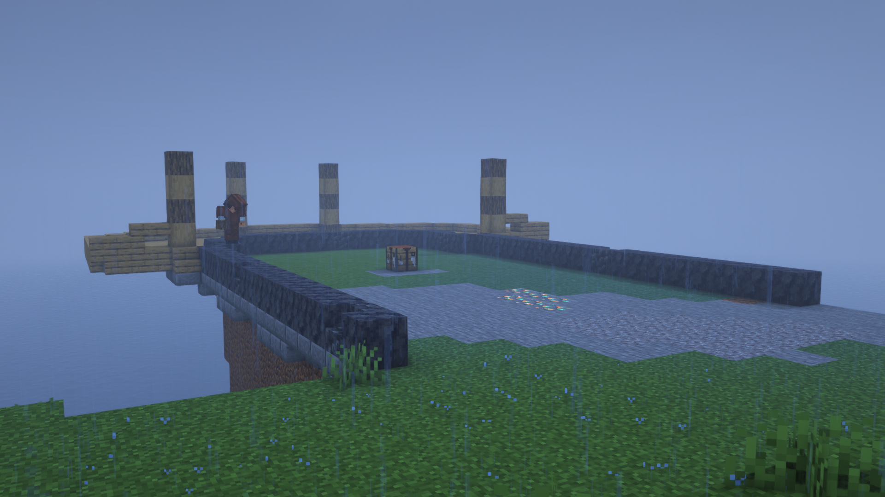
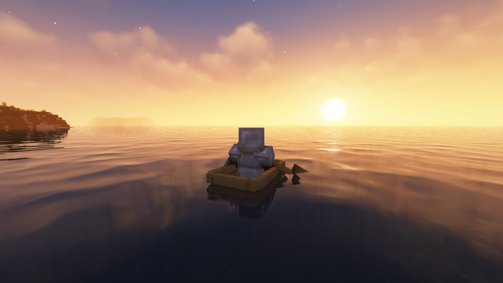
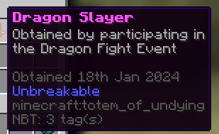

You probably know what Minecraft is, right? That game with the blocks, a 3D sandbox game of a world filled with voxels. But that's not really what it's about, to me at least.

It's not about punching a tree to get wood. It's about going over to a friend's house, where you get to play Minecraft splitscreen on their Xbox 360, while they teach you how to play, since you don't even know what most of the buttons do yet.

It's about getting pocket edition, exploring its weird and wonderful world generation, building a house, then going to school to talk about it the next day.

It's not about building. It's about attempting to build a chicken farm, making a mistake, exploding hundreds of chickens everywhere, laughing about it with friends for several minutes before they help you clean it up, and chickens becoming an in-joke between you.

It's not about surviving. It's about helping a friend build a house on the edge of a cliff despite the darkness, and rain pouring down around you, working together to try to survive.

It's not about exploration. It's about leaving that friend behind to explore a vast and isolating ocean, a feeling only made real by other people being in the same world, but not being with you.

It's not about beating the ender dragon. It's about Queen's Computing Society having their own Minecraft server, and putting on an event for beating the ender dragon and an extra challenge for everybody taking part.

I've played Minecraft for thousands of hours now, but only a tiny percent of that has ever been in single-player worlds.

It isn't about Minecraft. Minecraft could have been anything. It's about friends, and the time we spent together.
