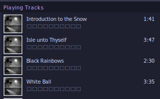

**If you're just wanting a script to install musicbee, see this [installation script](https://gist.github.com/autumn-mck/6d7fcbbc08f5d18be09f2cc219084675)!** The rest of this blog post is on how I wrote this script.

When I was using Windows, [MusicBee](https://getmusicbee.com/) was easily my favourite music player - for its customizability, how feature-rich it felt, and for me to as easily as possible play music the way I want to play it (either by artist or by album).

But when I switched to linux and tried out a range of music players that support it ([and I tried a lot of them](https://wiki.archlinux.org/title/List_of_applications#Graphical_13)), I ended up feeling disappointed in various ways by each of them. So what could I do to get MusicBee working on linux? And how much can I automate its installation?

Some quick searching brought up this [thread on the MusicBee forum](https://getmusicbee.com/forum/index.php?topic=30205.0). Perfect! So it looks like all we need to install to set up the [wine prefix](https://wiki.archlinux.org/title/Wine#WINEPREFIX) is `dotnet48`, `xmllite`, and `gdiplus`. This could be done through [winetricks](https://wiki.winehq.org/Winetricks)' GUI, but I'm looking to automate this! (After all, it's definitely worth spending an hour now to save one minute of clicking buttons in the future).

So to automate it, we'll export a couple of environment variables: Since dotnet48 apparently has issues in 64-bit wine prefixes, and MusicBee is 32-bit regardless, we can just use a 32-bit wine prefix. Normally wineboot prompts us to install wine-mono, but we don't seem to need it for MusicBee, so we'll disable that too.

```sh
export WINEPREFIX="$HOME/.local/share/wineprefixes/MusicBee/"
export WINEARCH="win32"
export WINEDLLOVERRIDES="mscoree,mshtml=" # We don't need wine-mono installed, no need to give a warning over it. https://bugs.winehq.org/show_bug.cgi?id=47316#c4
export WINEDEBUG=-all # Don't print any debugging messages for wine

winetricks arch=32 --unattended dotnet48 xmllite gdiplus
```

Note: If for some reason you're like me and want to compile a [MusicBee skin](https://github.com/catppuccin/musicbee), this wine prefix is able to run the required `SkinCreator.exe`.

Now we can download and run the MusicBee installer ourselves, but I was having fun automating stuff! MusicBee has two official download hosts: mega.nz and MajorGeeks. It looks like it could be downloaded from mega.nz by using [Megatools](https://megatools.megous.com/), but I don't feel like having to install that just for installing MusicBee. So can I do anything with MajorGeeks?

By looking at Firefox's network request inspector, it looks like the site first sends a request to `https://www.majorgeeks.com/index.php?ct=files&action=download&=`, which responds with a 302 (Moved temporarily) redirecting us to the actual download file. Cool! After a bit of experimentation, I was able to figure out that it figures out where to redirect us to based on the `PHPSESSID` cookie.


But how do we get that from the command line? Thankfully since this cookie is created and used by PHP on the server-side, we don't have to worry about running javascript or something. After some online searching and looking through cURL's manual page, it looks like the options we need are `-c` to save the cookies, and we can then use `-b` to load the file for our next request.

This gets us a zip file though, so we can pipe it to `funzip` to quickly extract the first file (In this case the only file, the installer), and write it to a temporary location.

Finally, we've got our installer! But if we just try to run it now, it (fairly unsurprisingly) just brings up the graphical installer. I want to automate this!

I'm not sure what MusicBee's installer is created with (possibly NSIS?), but after some searching to see what the common options were, I found that the "/S" flag makes it install silently (i.e. without bringing up a GUI to ask us to confirm stuff, and installs just with the default options).

```sh
mb_temp_file=$(mktemp --tmpdir MusicBee-XXXXXX.exe) # Create a temporary file to download musicbee to
curl -c ./MG_MB_cookie.txt https://www.majorgeeks.com/mg/getmirror/musicbee,1.html
curl -L -b ./MG_MB_cookie.txt 'https://www.majorgeeks.com/index.php?ct=files&action=download&=' | funzip > "$mb_temp_file" # Download the zip file containing the installer, pipe it through funzip to unzip it, and write it to the temp file
rm ./MG_MB_cookie.txt
wine "$mb_temp_file" "/S" # Assumes variables are set as above
```

So are we done? MusicBee seems to launch, but if I try to play `.m4a` files (which music from the iTunes store seems to use), MusicBee crashes? Looks like I got too far ahead of myself - if I'd read further down the forum thread, I'd see the creator of MusicBee saying it probably needed `bass_aac.dll`

From [a different forum post](https://getmusicbee.com/forum/index.php?topic=23454.0), it looks like we can download `bass_aac.dll` from un4seen.com, then move it into the MusicBee installation folder.

```sh
bass_aac_download_url="https://www.un4seen.com/files/z/2/bass_aac24.zip"
installation_location="$WINEPREFIX/drive_c/Program Files/MusicBee/"

curl -L -o bass_aac.zip $bass_aac_download_url
unzip -o bass_aac.zip bass_aac.dll
rm "./bass_aac.zip"
```

And that's it! MusicBee now works.



Except of course not. One of the artists of an album I own uses japanese characters, which seems to be displayed as just boxes. Installing `cjkfonts` (fonts with chinese, japanese, and korean characters) with winetricks seems to _partially_ fix the issue - except places where the text is bolded, where it still just displays boxes. I've not been able to find a better solution yet unfortunately, although I only discovered this issue a few weeks ago, so I'm still searching.

Ok, now it actually works!

## But what if we want to go further?

There's no reason to, but what if we do anyway?

First, let's try to integrate it better with our desktop environment. Wine automatically creates an [XDG Desktop file](https://wiki.archlinux.org/title/Desktop_entries) for us, but we can do marginally better.

Wine's attempt looks something like:

```ini
[Desktop Entry]
Name=MusicBee
Exec=env WINEPREFIX="[prefix here]" wine C:\\\\path\\\\to\\\\application.lnk
Type=Application
StartupNotify=true
Path=/path/to/exe
Icon=737E_MusicBee.0
StartupWMClass=musicbee.exe
```

Reading through the [XDG Desktop entry specification](https://specifications.freedesktop.org/desktop-entry-spec/latest/), it looks like we could improve a few things. By default, MusicBee is just listed under the category of "Wine" - from the available categories, I feel like AudioVideo, Audio, Player, and Music fit better. By default it also doesn't know that MusicBee can be used to open music files, eg from a file manager - I randomly picked a couple of common audio formats to associate with it.

```sh
cat > "./MusicBee.desktop" << EOL
[Desktop Entry]
Name=MusicBee
Type=Application
StartupNotify=true
Version=1.5
Comment=The Ultimate Music Manager and Player
Icon=737E_MusicBee.0
Categories=AudioVideo;Audio;Player;Music;
MimeType=audio/mp4;audio/mpeg;audio/aac;audio/flac;audio/ogg;
Exec=env WINEPREFIX="$WINEPREFIX" installation_location="$installation_location" "$installation_location/launch.sh" "%f"
StartupWMClass=musicbee.exe
SingleMainWindow=true
EOL

desktop-file-install --dir="$HOME/.local/share/applications/" --rebuild-mime-info-cache "./MusicBee.desktop"

# Remove the XDG Desktop entry generated by wine (ours is better)
rm -r "$HOME/.local/share/applications/wine/Programs/MusicBee/"
```

Trying to play a file from the file manager doesn't seem to work by default though :(  
MusicBee does apparently [support playing a file via the command line](https://breezewiki.com/musicbee/wiki/Command_Line_Parameters), so let's see what we can do with that! Just giving it the default linux file path doesn't seem to work - not too surprising, it's probably only expecting something in the Windows format. So we'll add a little script to rewrite that for us! All that's needed is to replace the '/'s with '\\'s, and say it's on the Z: drive (What wine uses to represent the linux system's folders).

This is the `launch.sh` file used for the desktop file above:

```sh
cat > "./launch.sh" << EOL
#!/usr/bin/env sh
file=\$(echo \$1 | tr '/' '\\\\') # Replace / with \\
wine "\$installation_location/MusicBee.exe" "/Play" "Z:\$file"
EOL
chmod +x ./launch.sh
```

And it works! Perfect.

## But what if we want to go even further?

Why? Because it's fun.

MusicBee supports addons, for example [DiscordBee](https://github.com/sll552/DiscordBee). What do we need to do to get it working? First let's just copy it to MusicBee's plugin folder, which would be enough on windows.

```sh
cd ./Plugins
curl -o DiscordBee.zip -L https://github.com/sll552/DiscordBee/releases/download/v3.1.0/DiscordBee-Release-v3.1.0.zip
unzip -o ./DiscordBee.zip
rm ./DiscordBee.zip
```

This isn't enough unfortunately - Discord's own desktop linux client, nor any of the better alternative desktop clients, seem to pick up on stuff through wine (I don't know if it's doable or not, I'm tempted to look into it and see).

But luckily I found [wine-discord-ipc-bridge](https://github.com/0e4ef622/wine-discord-ipc-bridge), which does what it says in the name! All we need to do is run it in the same wine prefix as musicbee, which is pretty easy to modify the last line of our above `launch.sh` to do.

```sh
cat > "./launch.sh" << EOL
#!/usr/bin/env sh
file=\$(echo \$1 | tr '/' '\\\\') # Replace / with \\
wine "\$installation_location/winediscordipcbridge.exe" & wine "\$installation_location/MusicBee.exe" "/Play" "Z:\$file"
EOL
chmod +x ./launch.sh
```


## Ok, we're finally done (for now)

You can see the [script for installing MusicBee, the DLLs to play `.m4a` files, and an improved desktop file](https://gist.github.com/autumn-mck/6d7fcbbc08f5d18be09f2cc219084675), or a [script that does that, plus install DiscordBee, a couple of skins, and downloads the settings I use](https://gist.github.com/autumn-mck/ef1fba379cb2429083cf76369d0b032a) - the latter isn't really useful to anybody other than me, but it's available if you want to customise it yourself!

I'm hardly the first person to do most of this stuff, but it was still a lot of fun! I enjoy doing things with computers and software that weren't exactly originally intended, and figuring out how I can solve problems.
