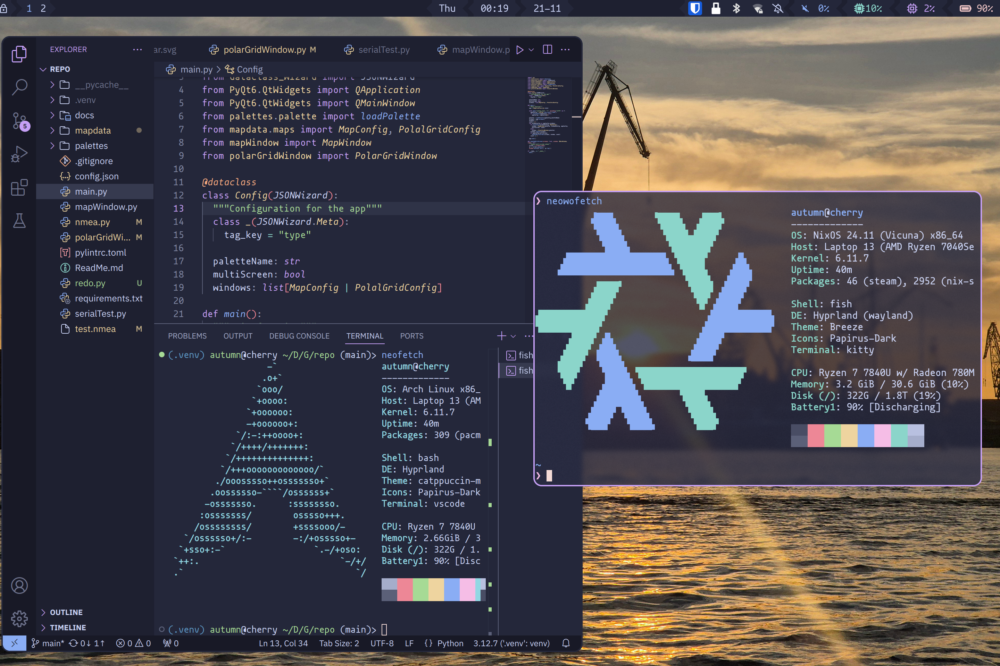

Short backstory: I've been trying out NixOS on my laptop for a few months now, and now I'm needing to set up python on it to work on my final year project.

On most linux distros, [venv](https://wiki.archlinux.org/title/Python/Virtual_environment) is the way to go for managing python packages, however due to NixOS not being [FHS-compliant](https://en.wikipedia.org/wiki/Filesystem_Hierarchy_Standard), it's not as simple.

The [NixOS wiki](https://wiki.nixos.org/wiki/Python) has a few suggestions:

## The recommended way (shell.nix)

As an example, here's what the shell.nix for my final year project was looking like:

```nix
# shell.nix
let
  # We pin to a specific nixpkgs commit for reproducibility.
  # Last updated: 2024-10-19. Check for new commits at https://status.nixos.org.
  pkgs = import (fetchTarball "https://github.com/NixOS/nixpkgs/archive/8c4dc69b9732f6bbe826b5fbb32184987520ff26.tar.gz") { };
in
pkgs.mkShell {
  packages = [
    (pkgs.python3.withPackages (python-pkgs: with python-pkgs; [
      # select Python packages here
      pyqt6
      dataclass-wizard
      pylint
      pynmeagps
      pyserial
    ]))
  ];
}
```

This _almost_ entirely works! Except. Because it's a nix shell and doesn't create a venv, VSCode doesn't know where to look for the packages, and constantly complains about missing imports. While absolutely not essential, I like type hinting and auto-completion within my IDE. Starting VSCode from within the shell didn't seem to work either, alas.

## What else can I try?

Does creating a venv with the system python work? Sort of, until you need to use a compiled package, where you'll get an error like `ImportError: libstdc++.so.6: cannot open shared object file: No such file or directory`. As much as I love NixOS, the combination of it's unique way of handling things, and my lack of knowledge of the "proper" way of doing things, are a bit of a pain sometimes.

The NixOS wiki suggests a few solution, the first of which is a script called "[fix-python](https://github.com/GuillaumeDesforges/fix-python/)", which attempts to patch the binary files in the venv to use the correct paths. An extremely cool idea! Unfortunately after running it, I was still getting the same error. The `libstdc++.so.6` file it was failing to fetch is part of one of the packages `fix-python` patches so it should have worked - it's possible it's related to [this issue](https://github.com/GuillaumeDesforges/fix-python/issues/6), however I don't have time to debug (yet), I have a project I need to work on.

I know the other solutions on the wiki are likely to work, but would take more time for me to learn than I have right now. So what else do I already know that I can bodge into a working solution?

## The bodged way

If you've not heard of it before, [distrobox](https://github.com/89luca89/distrobox) is a really useful tool that makes setting up a podman/docker container running a different distro, and integrating it with the rest of your system, really easy. Is this overkill? Absolutely. Does it work? Yes!

Creating the container was easy:

```sh
distrobox create --name arch-gnss --init --image archlinux:latest --pull --additional-packages "fish python nano"
# wait a bit for it to download the latest image and set up the container
distrobox enter arch-gnss -- fish # running fish since that's the shell i like
```

Now I'm in the container, I can set up a venv as I would on any other distro:

```sh
python -m venv .venv
source .venv/bin/activate.fish
pip install -r requirements.txt
```

And it works! But I've still not solved the earlier issue of VSCode not knowing where to look for the packages. So rather than using my host system's VSCode, I can install it in the container with `sudo pacman -S code`. I'm using the "Code - OSS" package rather than the `visual-studio-code-bin` package as they have store their config in different places, to avoid any conflicts, but I can still copy over my pre-existing config with `cp "~/.config/Code/User/settings.json" "~/.config/Code - OSS/User/settings.json"`. However this comes with a new issue: Microsoft, in their infinite wisdom, have decided that you can only run pylance, their extension for type hinting, on the official build of VSCode. Closed source software is great, isn't it? As [documented in this StackOverflow question](https://stackoverflow.com/questions/75345501/make-python-code-highlighting-for-vscodium-equal-to-vscode), it's possible to manually install an old version of the extension from 2023 - I'm not sure how long this'll continue to work for, but I only need it for a couple months. Incredibly janky, but it works!

As a final step, I can export the container's vscode to my host system to make it easier to run:

```sh
distrobox-export --app /usr/share/applications/code-oss.desktop # from within the container
```



Was there some other way to solve this? Probably. But I didn't have time to find it, and this works for now. And that's it! A bodged and janky, but working, solution.
