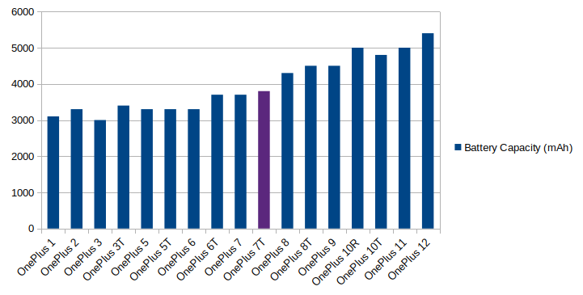
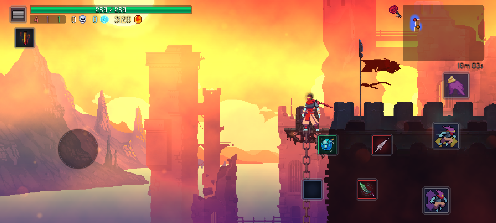

Recently my Flip 4, which I'd been using for about a year, stopped charging, claiming the "temperature was too low". So before sending it in to be repaired (before it being returned with them saying the battery/charging port issue couldn't be fixed under warrenty, as the screen had some tiny cracks in it??), I switched everything back to my OnePlus 7t, which I'd kept around just in case something like this happened.

The 7t is definitely still a fantastic phone, but this also prompted me to check in on the current state of phones again. So what's changed since the 7t was released back in September 2019?

## Hardware

### Screens

The 90Hz screen of the 7t is still amazingly smooth and responsive. On newer phones 120Hz is becoming more common, and it is marginally smoother - but I can only spot the difference if I have the two side by side, and it's such a small diference I don't think it's worth the battery life.

(The easiest way to make any android phone feel snappier is to set the animation scales to 0.5x in developer settings - I honestly feel like this should be the default)

Like the 7t, most new phone screens are also still beautiful OLEDs of some type or another - high dynamic range, good viewing angles, vibrant colours. If you have a phone, it's very likely it has the best screen you have access to.

Screen resolution increases are far beyond the point of diminishing returns and just at the point of not being noticable at all. Even with the current phone sizes, 1080p is more than enough for individual pixels to not be noticable. It's nice that it seems most new phones are chosing not to waste money and battery life to go above this.

Phone bezels haven't been pushed out much further - screens have been about as close to the edge as they can be for a while now, with great screen-to-body ratios.

### Cameras

These days, software is a much more important part of how photos look. The cameras themselves still have about the same resolution, although improvements like a larger sensor and optical zoom can still be made. They definitely have continued to improve over time, but my 7t is still more than capable enough for whatever random photos I feel like taking.

Compared to photos from the flip 4, I really can't tell if it's better or not? If I'm having to pixel peep to find any differences then they must be pretty negligable. Both can take fantastic photos, which is more than good enough for me!

(It bothers me that the flowerbed in this photo is off-centre, I'll try to retake it this summer)

### Batteries

Battery capacities have increased over time, but the changes have been fairly small and incremental. Using OnePlus as an example:

There's not really anything exciting here. Definitely nice to have, but not particularly exciting, and hardly worth releasing nearly 2 phones every year for.

### Aesthetics / form factor

On the outside, phones haven't changed much. They're still flat rectangles, a mixture of glass and either metal or plastic, with camera bumps still changing shape and jumping around. Some phones are experimenting with folding in various directions, but having tried the flip 4 myself, it feels more like a slightly inconvenient gimmick rather than a useful feature.

Phones keep alternating between rounded and flat edges, so there can at least be some visual difference between phone generations, but whichever you prefer is just personal preference.

Front cameras are still in either a teardrop or pinhole at best - at some point, under-screen cameras will likely become more common, but it's not enough of a change for me to look forward to.

### Performance

CPU and GPU performance and memory have kept increasing, but none of it enables any new use for phones. It feels like chasing after higher numbers for the sake of having something to advertise, regardless of how much of a difference it actually makes for the end user.

My 5 year old phone is still perfectly capable of displaying everything smoothly at 90Hz, with no hitches or slowdowns. Maybe these specs still matter if you're playing some intensive 3d game on your phone, but the only mobile games I've wanted to play have been Slay the Spire and Dead Cells (Both aamzing games! and ported well to mobile)

### Other

Most phones today are equally lacking in a headphone jack compared to the 7t :(

Even the need for storage has significantly slowed down - the base 128gb my 7t came with is plenty for my 34gb of music, and 21gb of all my photos and videos from the last decade.

## Software

Thanks to all the volunteers who contribute to [LineageOS](https://lineageos.org/), my phone from 5 years ago runs Android 14, and the most recent security patch.

As a side-note, the look of stock android has really grown on me. Its much more frequent use of material UI and overall design just feel comfy to me.

Compared to the updates from OnePlus themselves, which:

- Usually took months to release
- Frequently introduces more bugs which were never later fixed (e.g. split-screening apps broke with the update to either Android 11 or 12)
- Only received 2 major Android updates (10 -> 12)

It's a shame that such a great phone was just abandoned by the manufacturer, when it's capable of lasting much longer.

## So?

The 7t was £550 when it launched (nearly 5 years ago at time of writing!), so it's not as if it was extremely expensive relative to other phones at the time - the S10 launched at £800 the same year.

In my opinion, this lack of change has actually a good thing in this case. It means manufacturers are having to focus on providing longer-term support for their devices (e.g. at the start of this year, samsung announced they'd extend their android and security updates to 7 years! Although I'm waiting to see how well they follow through on that). Hopefully this will also lead to less e-waste, with people replacing their devices less frequently.

However, what also needs to happen is for phones to become more repairable. Replacing a battery or screen should be as easy as possible. Fairphone have proven this is doable. When a phone is still just as capable as it was when it was released, and its only issue is the battery having been worn down over time, I think it's reasonable that a user should be able to replace the battery themselves.

At some point in the future, phones will likely change or be replaced in some way that actually allows them to do something that they can't currently, but I don't see that happening any time soon. It's not folding phones, and it's definitely not an "AI" wearable computer pin.

Until then, at 5 years old my phone isn't feeling old at all.
