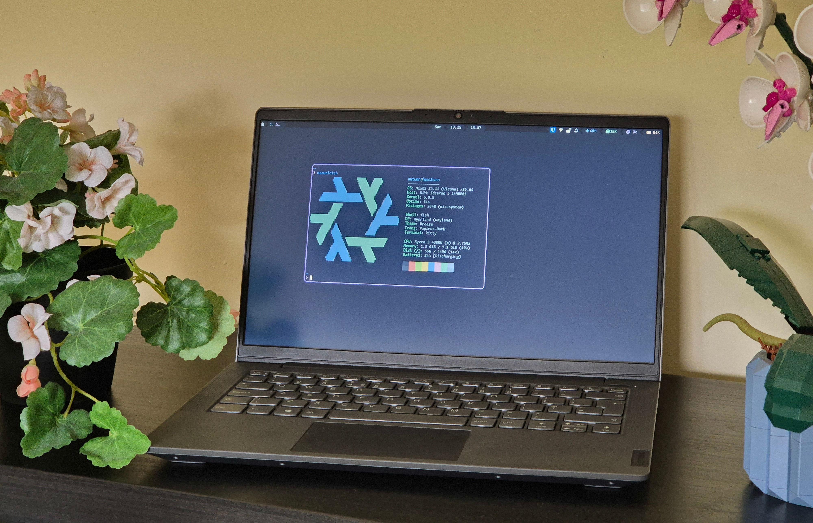
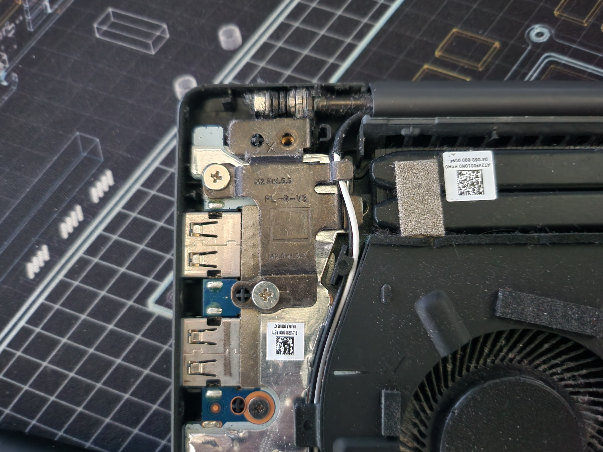
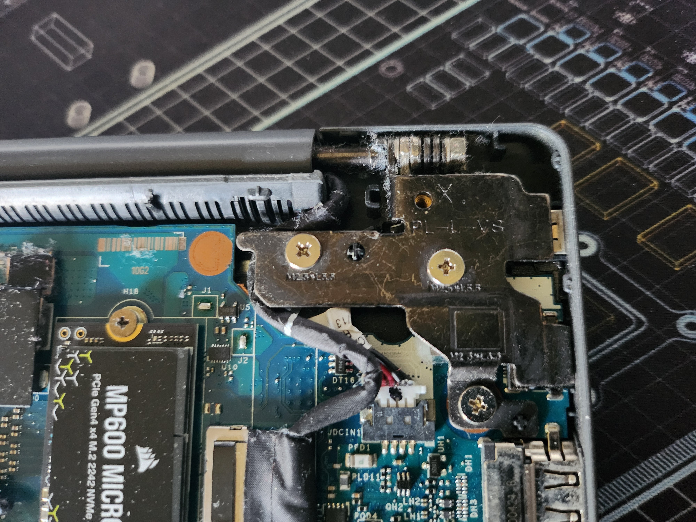
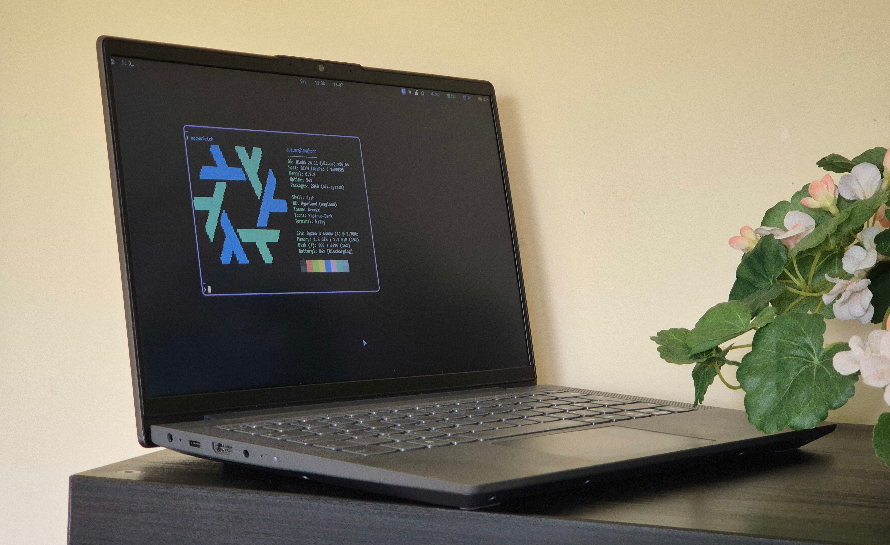

# What?

I'm looking into replacing my current laptop (a lenovo ideapad 5 14are05) as the 8gb of RAM I bought it with is beginning to become a limitation, and I've had to be actively keeping an eye on memory usage when trying to do anything more intensive. Although it's been a fantastic laptop and otherwise I've liked it a lot, I don't like having to keep an eye on memory usage, so the memory not being upgradable is now become an issue for me.

So now that I've pretty much finished using it as a laptop (I'll very likely attempt to repurpose it into a server at some point), I felt like writing an overview of its specs and how I found using it, to me understand what I've liked about it and what I want from a laptop.

As a warning, this blog post is going to be fairly dry and boring - even more so than most of my other blog posts, it's meant to be written, rather than actually read! For something more interesting, maybe see [my blog post on writing a music display for my website](../small-projects-for-fun/).

# Hardware

## CPU

Ryzen 3 4300U

The main reason I picked this laptop specifically! It was one of the first and cheapest laptops to release with the Zen 2 architecture, which I'd been impressed by when I built my desktop PC with a 3600x the previous year. Although the 4300u is the lowest end 4000 series mobile CPU, with 4 cores/4 threads it's still amazing for the price, and has performed well for all my needs. The iGPU is enough to run some basic indie games - more performance would've been nice, but it covered the basics well enough.

## Display

14" 1080p IPS screen @ 60Hz

It's able to get bright enough for most of the time, but it's definitely too dim for direct sunlight (thankfully with the weather here, that's pretty rare)
I don't have any fancy tools for measuring colour accuracy, but to me it's a good looking and well-balanced screen, what you'd expect from a decent IPS panel.
Mine has no noticeable uniformity issues, and the matte screen and good viewing angles have made it a great screen for my general use.

At 60Hz it's not any smoother than any of the rest of my monitors, but given the performance of the integrated graphics, it'd only really be the mouse cursor and moving windows around that would benefit. (Again at the price, I'm not really complaining or expecting better)

The hinges are well enough built, with the screws securing them in place fairly well spread out. (They're badly labelled as M2.5xL5.5, but at least some thought went into that!). The display cable doesn't seem to have worn out and the hinges are still good after 4 years of use, so I'm happy to call this aspect well designed! (Although unfortunately does take two hands to effectively open)

## Storage

Has space for a M.2 2280 NVMe drive, and a M.2 2242 NVMe drive, with both slots being easily accessible. The configuration I bought came with a tiny 128GB 2242 drive, which is mostly my fault as that's deliberately what I chose to save money. I've upgraded and added more storage since, but 128GB was just enough for a basic windows install and the handful of programs I needed for A-level software systems development, even if it felt like a bit of a squeeze at times. Even with that lowest possible spec drive, it still had a DRAM cache and always felt fast (having any sort of SSD is almost always the best first upgrade for an older system)

## Battery

57Wh

The battery is secured by 2 helpfully labelled M2x3 screws, and is easily replaceable (not that I've needed to, thankfully!)  
4 years later, lenovo are still selling replacement batteries, for £72 (Part number 5B10W86939) - feels a little more expensive than it should be, but still good to see some effort towards repairing or extending the lifespan of devices like this.

## Webcam

It has one, it's worked well enough when I needed it for drum lessons and uni lectures. Like most laptop webcams it's pretty bad, but worked well enough for my needs.

## Speakers

It has them, I guess? I don't think I've ever used them, nor do I ever really use other laptop speakers to be able to compare - I stick to headphones and earbuds to avoid ~~annoying others~~ making others jealous of my music taste.

## Ports

Left side:

- Barrel plug (5.5x2.5, centre positive) - the power brick it came with was a 65w charger, which has made the charging experience about as nice as it could be without also being USB C
- USB C 3.0 port - supports charging and DisplayPort over USB C thankfully! So I can still charge it with the other USB-C chargers I have
- HDMI port - Not had any need to use it
- 3.5mm headphone/mic combo jack - has occasionally had issues with crackling while trying to drive 250ohm DT990s, but otherwise worked well enough

Right side:

- 2x USB A 3.0 ports, with a reasonable amount of space between them (never had issues trying to plug in two things at once, compared to some other laptops which stick the ports closer together)
- SD card reader - I've only used it for reading some files from an old Raspberry Pi's SD card, so I can say it works, but I've not had any reason to test its speed

## Other

Has a Realtek 8822CS wifi/bluetooth card, which I've not had any issues with. No fingerprint reader or anything fancy - It's a very standard laptop

Trackpad 10.5cm x 6.5cm - has felt a little on the small side

Keyboard - has been pretty good! Not fantastic, but I've done a lot of typing on it by now, and when I'm typing I don't notice the keyboard, which I think is ideal

Overall construction - feels well built and solid. The metal top feels and looks nice, I like how small and off to the side the logo is (although I'd prefer none at all, as somebody who doesn't enjoy paying a company money to advertise their products). The bottom half is some kind of plastic, but feels surprisingly decent, and has held up so far over time.

# Software

## Linux support

By the time I got around to installing linux on it (maybe a year or so after I got it?) pretty much everything was fully supported, so for the most part everything just worked! Apparently the 14are05 was popular enough it got its on page on [the Arch wiki](https://wiki.archlinux.org/title/Lenovo_IdeaPad_5_14are05), which covers some of the original issues.

I did have an issue with the trackpad occasionally thinking it was instead a mouse, which broke gestures (including just scrolling) and significantly increased its sensitivity, but this was always fixed by quickly putting the laptop to sleep for a second so I wasn't too bothered. (Did I ever make a bug report about this? No. Should I have? Yes! Will I? Nah)

# Overall

I'm really glad I bought it when I did - I loved it when it was new, and for the most part it's lasted very well over the last 4 years.

Since I got a student discount when buying it, it was also an amazing price at £414. For that, there was nothing else available at the time that really came close.

I am slightly sad to be replacing it, but I have plans to use it for other things so I'll still have it around. It's been a great laptop!
