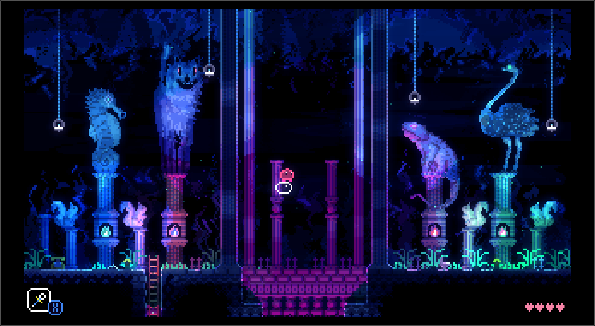
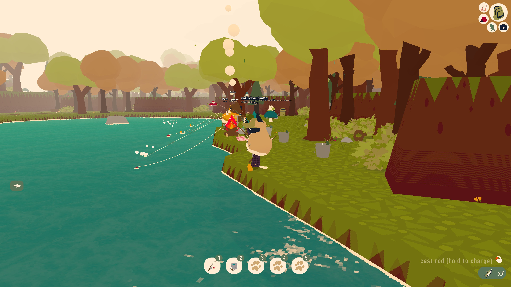
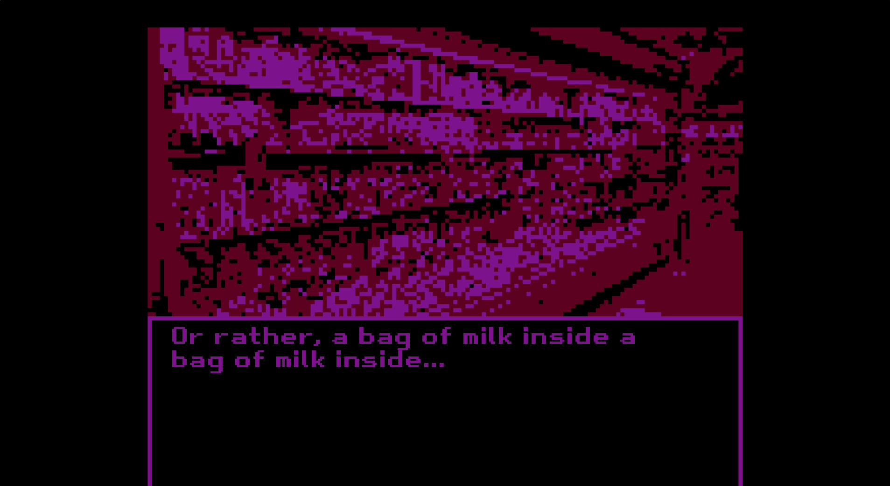

## Citizen Sleeper

Released: 2022, playtime: 8.1 hours

You play as a robot who has just escaped from the corporation that legally owned you, and they'll soon be hunting you down. Your body is falling apart, and requires constant upkeep to be able to get anything done, the materials for which you'll need to obtain in ways that feel dubiously legal. <!-- you can tell that the person who made it is also trans -->

That's not what citizen sleeper is about though - it's a game about hope, about existing in a world that feels at times actively hostile to your existance yet existing anyway, about people helping each other, and maybe working towards something better.

There's also a fantastic [interview with the developer](https://www.youtube.com/watch?v=ofBbL2vT20g) which has criminally few views.

Cyberpunk in the actual meaning of the word, not just as an aesthetic. Intensely relatable. Stay in the orbit of others, and take care of each other.

## Vampire the Masquerade: Bloodlines

Released: 2007, playtime: 29.3 hours

Such an amazing game, despite completely falling apart towards the end. (I love the ending[s] itself though!) One of the best RPGs ever made, and one of the worst sewer levels ever in a game.

Like a lot of games its age you'll need the [VTMB Unofficial Patch](https://www.moddb.com/mods/vtmb-unofficial-patch), which fixes a lot of bugs and optionally adds back some cut content.

## Animal Well

Released: 2024, playtime: 14 hours

A platformer and puzzle metroidvania. You find secrets. You keep finding secrets. Then you get some item that allows you to find even more secrets. Incredibly pretty, incredibly well made, incredibly fun to play.

## Webfishing

Released: 2024, playtime: 19.1 hours

A chatroom with a multiplayer fishing minigame attached - If you've ever used chatrooms before, you know the experience! The vibe of the game really preselected people with similar interests to me - I've never had people identify what my username is a reference to before, and everybody I met was fun to talk to. These cats gay! Good for them.

Also, the displayed servers are all people local enough to you - it was great to hang out with a bunch of people in ireland and scotland.

## Lookouts

Released: 2022, playtime: a couple hours

oh my god it's the cutest thing ever i love both of them so much they're the best

## Milk inside a bag of milk inside a bag of milk

Released: 2020, playtime: 18 minutes

A game about buying milk, and mental illness. It's short. It's good. Play milk outside a bag of milk outside a bag of milk too.

## Tactical Breach Wizards

Released: 2024, playtime: 6.7 hours

Have you ever played Into the Breach and loved it, but felt like it could be even better? Tactical Beach Wizards is that.  
Have you ever needed to blast somebody out of a window? Tactical Beach Lizards does that.  
Have you ever ached to read one of the most tightly written and funny scripts ever? Practical Beach Lizards has that.  
Have you ever wanted to feel like a genius for solving a really good puzzle? Practical Peach Blizzards allows that, if you're smarter than I am.  
You should play Actual Peach Blizzards.

## Honorable mentions:

- Umurangi Generation - I'm angry we're living in the pre-apocalypse
- The Witness - Despises your time and probably you as well, otherwise it's great
- (the) Gnorp Apologue - This is the usecase for writing your own game engine in rust
- Balatro

## 5 Games I'm looking forward to in 2025:

- Silksong - 2025 for sure!
- Citizen Sleeper 2: Starward Vector - played the demo
- Slay the Spire 2 - honesly I don't know how it could improve on the first, but I'm excited to see regardless
- A game that didn't yet have a name when I played the demo at NIDC 2024, a mixture of N++ and Lunar Lander
