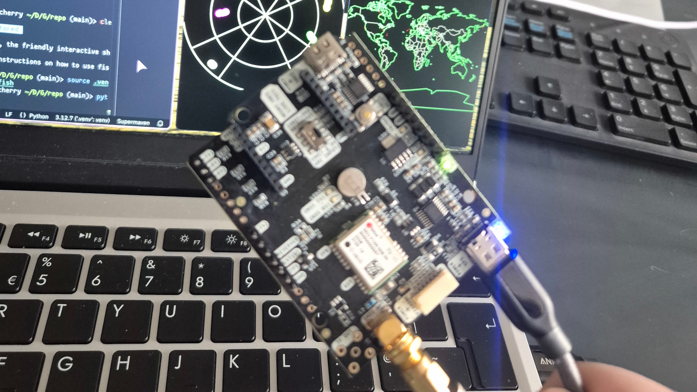

[Skip to the glossary](#what-does-any-of-this-stuff-mean) at the bottom if you don't know what any of that means, we don't have time for that now!

First, connect your antenna to your receiver via the SMA connector labelled "RF IN". Connect the the receiver to your computer via USB, making sure to use the port lablled "POWER + GPS" on the receiver. The receiver should power on, and two LEDs should begin pulsing every second.

## In the command line

If you're on Linux: Install [tio](https://github.com/tio/tio) with your package manager, then run:

```sh
tio --baudrate 38400 /dev/ttyUSB0
```

If you're on Windows: Install [PuTTY](https://www.putty.org/), then run:

```sh
putty -serial COM4 -sercfg 38400
```

(Might be COM3, COM5, etc. Check Device Manager)

## In python

Install the `pyserial` package with pip:

```sh
pip install pyserial
```

```python
import os
from serial import Serial

SERIAL_PORT = "/dev/ttyUSB0" if os.name == "posix" else "COM4"
BAUDRATE = 38400
with Serial(SERIAL_PORT, BAUDRATE) as stream:
    while True:
        print(stream.readline().decode("utf-8"))
```

## Never mind, I want a GUI

On windows, I'd recommend [u-center 2](https://www.u-blox.com/en/product/u-center). On Linux, there seemingly aren't many good options (yet :3), but [PyGPSClient](https://github.com/semuconsulting/PyGPSClient) seems to work well.

## What does any of this stuff mean?

GNSS: Global Navigation Satellite System - the generic term for any satellite navigation system, the most well-known of which is GPS (US). Galileo (EU), GLONASS (Russia), and BeiDou (China) also exist. Although they're ran by different countries\*, they all cover the entire globe.

NMEA (0183): The standard communication specification for GNSS receivers, among other things.

SMA: A type of coaxial connector, used to connect the antenna to the receiver.

ArduSimple simpleGNSS: The receiver I'm using for this guide and my final year project, as it's cheap and easy to use. Other products are available.



Baud rate: The rate at which bits are expected to be transmitted over a serial connection.

A short blog post while I'm busy with my final year project, as I wanted to make sure I don't forget about having a "blog" for another two years.
