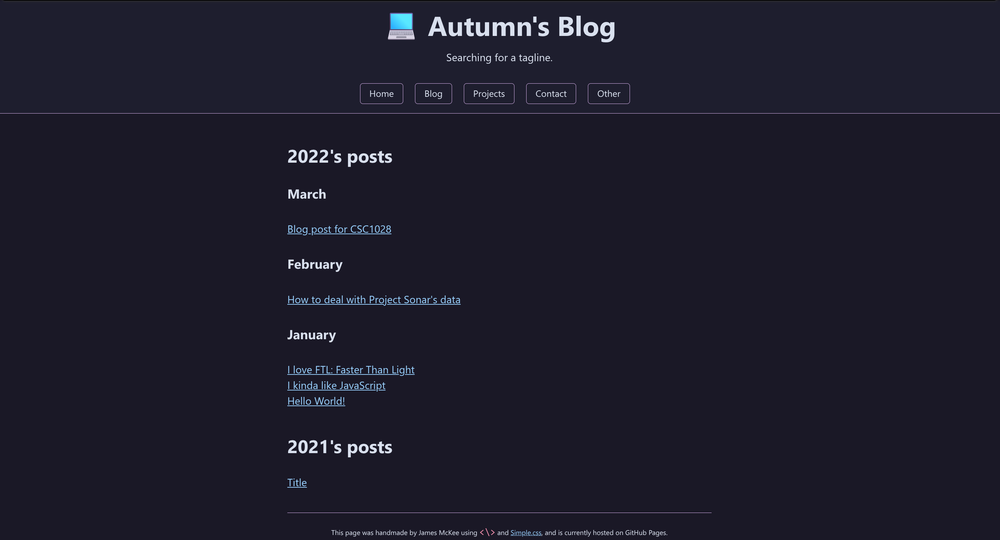

# Changelog

Redesigning a site is fun! It gives me a chance to try out some new ideas, and see how the browser landscape has changed since I last looked. Here's how this site has changed over time:

## v2 - Astro - 2024

The current version! Hopefully it lasts for at least a couple of years.

## v1 - WebGenJava - 2022-2023

I wrote a custom static site generator from scratch to translate markdown into HTML, and build a website out of it. A terrible idea that I had a lot of fun doing anyway!

Every page but the index page used a custom version of [Simple.css](https://simplecss.org/), a great stylesheet for semantic HTML.

## v0 - handwritten - 2021ish

I don't know why I thought trying to cram so much text on the right was a good idea?  
Gradually grew over time to become v1. For the most part I prefer how v1 looks, although I do quite like how I styled the h-card on the left.
