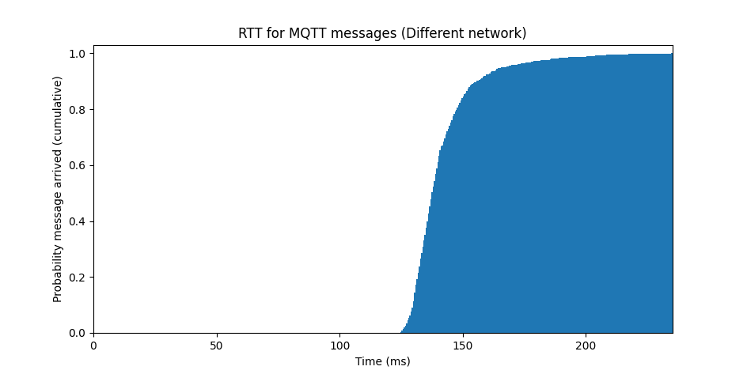

This is the dissertation for my BSc Computer Science final year project, November 2024 - April 2025.

### Abstract

Global Navigation Satellite Systems (GNSS) are used to provide positioning data to billions of devices and people across the world.

With current tools being unable to adequately present GNSS data engagingly on a large scale, this project both provides a tool for visualising GNSS data in real-time, and acts as a display piece optimised to take advantage of the matrix of displays in QUB's Cyber Physical Systems Lab, aiming to get people interested in the topic of GNSS. Given the constraints of this environment, the project is architected to allow different parts of the system to run across multiple computers.

Heavily inspired by the displays in the movie "WarGames" (1983), it features satellite tracking, measures of accuracy, stability, and interference, along with positioning data.

### Code

The code for this project is available online on GitHub [^2].

[^2]: A. McKee, GNSS War Room (GitHub). Python. [Online]. Available: https://github.com/autumn-mck/gnss-war-room

### Acknowledgements

I am incredibly grateful to my supervisor, Dr. David Laverty, both for providing guidance throughout the project, and for fuelling my passion to do the best I could do.  
Thanks to my family, for their continued support throughout.  
Thank you to all my friends, I wouldn't be who I am today without you.

---

### Table of Contents

- [1.0 Introduction and Problem Area](#10-introduction-and-problem-area)
- [2.0 System Requirements and Specification](#20-system-requirements-and-specification)
  - [2.1 Use cases](#21-use-cases)
    - [2.1.1 Lab visitors demonstration](#211-lab-visitors-demonstration)
    - [2.1.2 Students learning about GNSS](#212-students-learning-about-gnss)
    - [2.1.3 Researcher monitoring signal quality/interference](#213-researcher-monitoring-signal-qualityinterference)
  - [2.2 Functional requirements](#22-functional-requirements)
  - [2.3 Non-functional requirements](#23-non-functional-requirements)
- [3.0 Design](#30-design)
  - [3.1 Data flow](#31-data-flow)
  - [3.2 Colour palette](#32-colour-palette)
  - [3.3 Font](#33-font)
  - [3.4 Map](#34-map)
  - [3.5 Security](#35-security)
  - [3.6 Performance](#36-performance)
  - [3.7 Persistence](#37-persistence)
  - [3.8 Data input](#38-data-input)
  - [3.9 User Interface](#39-user-interface)
- [4.0 Implementation](#40-implementation)
  - [4.1 Hardware](#41-hardware)
    - [4.1.1 GNSS Receiver](#411-gnss-receiver)
    - [4.1.2 Computers](#412-computers)
  - [4.2 Languages/development environments](#42-languagesdevelopment-environments)
  - [4.3 Libraries/packages](#43-librariespackages)
    - [4.3.1 Desktop client](#431-desktop-client)
    - [4.3.2 MQTT Broker](#432-mqtt-broker)
    - [4.3.3 Web API](#433-web-api)
    - [4.3.4 Web UI](#434-web-ui)
  - [4.4 Important functions/algorithms](#44-important-functionsalgorithms)
    - [4.4.1 Elevation/azimuth to latitude/longitude](#441-elevationazimuth-to-latitudelongitude)
    - [4.4.2 Elevation/azimuth to position on a radial graph](#442-elevationazimuth-to-position-on-a-radial-graph)
    - [4.4.3 Latitude/longitude to Gall stereographic coordinates](#443-latitudelongitude-to-gall-stereographic-coordinates)
  - [4.5 Issues encountered](#45-issues-encountered)
    - [4.5.1 Custom UI generator](#451-custom-ui-generator)
    - [4.5.2 Qt bug](#452-qt-bug)
    - [4.5.3 Responsive chart generator](#453-responsive-chart-generator)
    - [4.5.4 Custom 3D globe/satellite viewer](#454-custom-3d-globesatellite-viewer)
  - [4.6 Code organisation](#46-code-organisation)
- [5.0 Testing](#50-testing)
  - [5.1 Unit tests](#51-unit-tests)
  - [5.2 Network Performance](#52-network-performance)
    - [5.2.1 Same computer](#521-same-computer)
    - [5.2.2 Same network](#522-same-network)
    - [5.2.3 Different network](#523-different-network)
    - [5.2.4 Analysis](#524-analysis)
  - [5.3 Uptime](#53-uptime)
  - [5.4 Stress-testing](#54-stress-testing)
- [6.0 System Evaluation and Experimental Results](#60-system-evaluation-and-experimental-results)
  - [6.1 Comparison with existing software](#61-comparison-with-existing-software)
  - [6.2 Conclusions](#62-conclusions)
  - [6.3 Future work](#63-future-work)
- [7.0 Appendices](#70-appendices)
  - [7.1 Photos and screenshots](#71-photos-and-screenshots)
- [8.0 References](#80-references)

---

### 1.0 Introduction and Problem Area

Global Navigation Satellite System (GNSS) is a term used to describe a constellation of satellites providing positioning, navigation, and timing services to billions of devices across the globe. The most well-known of these systems is the Global Positioning System (GPS), however several others are also in operation, including Galileo, GLONASS, and BeiDou.

GNSS satellites contain precise and accurate atomic clocks. By making use of signals broadcast from at least four satellites, GNSS receivers can determine their position on Earth to within a few metres - a technique known as trilateration or multilateration [^3]. A GNSS receiver outputs significantly more data than just the position and speed of its receiver – it also includes the derived time and date, information on all satellites currently in view, which satellites are being used for tracking, along with measures of error (dilution of precision) [^4]. This positioning data can be further enhanced by a range of further techniques, including real-time kinematic positioning (RTK), giving a precise location relative to a base station, and Differential GPS/GNSS, using a network of reference stations with precisely known positions.

[^3]: P. R. Escobal, H. F. Fliegel, R. M. Jaffe, P. M. Muller, K. M. Ong, and O. H. Vonroos, 'A 3-D Multilateration: A Precision Geodetic Measurement System', JPL Q. Tech. Rev., vol. 2, no. 3, 1972, [Online]. Available: https://ntrs.nasa.gov/citations/19730002255

[^4]: PA3FUA, 'GPS - NMEA sentence information'. [Online]. Available: https://aprs.gids.nl/nmea/

It would be useful to have a display of data from a GNSS receiver on a matrix of displays in QUB's Cyber Lab, to aid with teaching, research, or testing, as it would provide a visual representation of GNSS data and quality information. Although this matrix of displays has already been built (see <a href="#displays">The matrix of displays in the Cyber Lab</a>), it currently received very limited use.

With the goals of interesting people in the topic of GNSS, and of fitting the room available for the display (i.e. being viewed from, several metres away), the UI should attempt to emulate the look of something from a movie – in this case, WarGames (1983) has been chosen due to its eye-catching use of strong colours, picturing a "war room" [^5] replicable by the Cyber Lab's set of displays, and the continued use of WarGames' "war room" in the background of other films [^6].

[^5]: J. Badman, WarGames, (1983).

[^6]: A. Kückes, 'Screen Art: WarGames'. [Online]. Available: https://hp9845.net/9845/software/screenart/wargames/

Although software for viewing some data from GNSS receivers already exists, all have issues that would render them unsuitable for this use-case, either requiring the receiver to be attached to the same device displaying the data, not being optimised for the matrix of displays in the Cyber Lab, or displaying a limited subset of data (See <a href="#61-comparison-with-existing-software">6.1 Comparison with existing software</a>). Additionally, they do not combine this with the data from a precise time source, to display the precision of the GNSS time. To cover cases where the data should be displayed in other locations, a web front-end should also be provided, alongside an API, to allow other user interfaces to be created without having to re-implement all the logic required for parsing and extracting data from NMEA messages.

As the Ashby building also has receivers for ADS-B (Automatic Dependent Surveillance–Broadcast, i.e. aircraft positioning) and AIS (automatic identification system, i.e. ship positioning), it would also be useful to have a display of this data alongside the GNSS satellite data to provide a more complete picture of positioning and navigation data.

---

### 2.0 System Requirements and Specification

Throughout the project the earth has been assumed to be a perfect sphere, rather than more accurately an ellipsoid or geoid [^7], as for this project the difference is negligible – it is more limited by the resolution of a satellite's position being limited by being given in integer format [^4].

[^7]: H. Fan, 'On an Earth ellipsoid best-fitted to the Earth surface', J. Geod., vol. 72, pp. 511–515, 1998, doi: https://doi.org/10.1007/s001900050190.

#### 2.1 Use cases

##### 2.1.1 Lab visitors demonstration

Scenario: A group of people are touring the Ashby building during an open night or other event, and the "War Room" is already displayed, or ran by the demonstrator  
Goal: Impress visitors at a glance, showcase the capabilities of the CPSL, and generate interest in GNSS  
Usage:

- Attract attention with the large scale and eye-catching aesthetic, creating a visually-striking installation
- Show the world map with real-time satellite positions, using the key to point out different satellite networks, and explaining how GNSS works
- Using the polar grid, show where in the sky various satellites are
- Demonstrate that the latitude and longitude mentioned in the statistics window match up with those measured from a mobile phone or similar
- Explain how the project utilises the facilities of the Ashby building, with the antenna on the roof plumbed down to a GNSS receiver, displayed on the large matrix of screens
- Act as a "screensaver"-style application to display in the background while other tasks are taking place in the lab

##### 2.1.2 Students learning about GNSS

Scenario: In a lecture or similar lab session  
Goal: Provide a visual tool to help students understand how GNSS can be utilised  
Usage:

- Sorting the signal to noise ratio (SNR) chart for the satellites, sort by elevation angle to see the correlation with SNR, demonstrating how having to travel through less of the atmosphere reduces interference.
- Use the ability to replay prerecorded data to demonstrate specific scenarios, e.g. ongoing interference, jamming, spoofing, or the effect of a GNSS receiver cold start
- Referencing the trail of previous satellite positions in the 2D and 3D world maps, demonstrate how the satellite orbits provide constant global coverage. Depending on where on earth the receiver is located, this could also be used to show the different orbits used by some satellites (e.g. most QZSS satellites in geosynchronous orbit, some GPS satellites in geostationary orbit)
- Students can access the web UI and API to experiment with on their own devices, without having to have their own GNSS receiver, or installing and setting up the whole project

##### 2.1.3 Researcher monitoring signal quality/interference

Scenario: A researcher testing a new GNSS antenna/receiver or investigating local interference  
Goal: Provide a detailed view of the output of the GNSS receiver for analysis and testing  
Usage:

- Track DOP and fix quality in the statistics window to optimise placement of the antenna
- Use SNR chart to see which networks the antenna/receiver support, and how strong a signal it gets for each of them
- Monitor the raw GNSS log for debugging purposes, e.g. identifying an unsupported GNSS by its talker ID
- Utilise the system's stability and proven uptime for long-term tracking of stability
- Check if specific azimuths are being blocked/degraded by nearby buildings

#### 2.2 Functional requirements

A set of functional requirements (as in what the system is supposed to do) is provided below, as a set of aims for the project:

- A window should display the location of satellites overlaid on a map of the earth
- On this map, the user should be able to zoom in and out, to focus on specific parts of the map in more detail
- On this map, the user should be able to move which area of the earth is at the centre/being zoomed in on
- On this map, the user should be able to toggle if satellite ground tracks are displayed or not, to reduce the visual noise of the display
- On this map, the user should be able to toggle if data from the GNSS receiver is displayed or not
- On this map, the user should be able to toggle if data from the ADS-B receiver is displayed or not
- On this map, the user should be able to toggle if data from the AIS receiver is displayed or not
- On this map, the user should be able to toggle between several different scaling methods - the map being scaled with both the window's width and height, or just scaling with the width, or just scaling with the height, or not scaling with either and remaining at a constant physical size regardless of the window's size.
- On this map, the user should be able to toggle on and off useful features for identifying locations of satellites, e.g. country borders, and large cities.
-
- A window should display the relative positions of satellites on a polar grid
- On this polar grid, the user should be able to toggle if previous positions of satellites are displayed or not
-
- On both the map and polar grid, a key should be displayed to allow the user to differentiate which network each satellite belongs to
- On both the map and polar grid, the user should be able to move the displayed location of the key, to avoid it covering useful data.
- On both the map and polar grid, the user should be able to toggle if the key is displayed at all or not.
-
- A window should display the raw message log of the GNSS receiver
- A window should display a range of statistics derived from the receiver; i.e. the measured location, time, quality of the connection to the satellites, Allan variance compared to precise time, etc.
-
- A window should display a chart of each satellite's signal to noise ratio
- On this chart, the user should be able to toggle if untracked satellites are displayed or not
- On this chart, the user should be able to toggle between if the chart is sorted by which network they are a part of, or their signal to noise ratio, or their elevation
-
- For all windows, the user should be able to toggle if the window is full-screened or not
- For all windows, the user should be able to resize the window, with the contents adapting to this new size
-
- The web UI should provide all the above windows, allowing for possibly reduced functionality due to being a different method of interaction
- The web UI should additionally a 3D version of the map
-
- The user should be able to configure the application by editing a human-readable configuration file
- In this configuration file, the user should be able to configure which windows appear on startup
- In this configuration file, the user should be able to set the initial state of each window
- In this configuration file, the user should be able to set which MQTT broker is used
-
- The network each satellite is part of should be indicated by a unique colour, with a key showing which colour is which network
- The system should allow for multiple windows of the same type, e.g. two maps focused on different points
- The system should allow live GNSS data to be displayed
- The system should allow prerecorded GNSS data to be replayed and displayed

#### 2.3 Non-functional requirements

Similarly, a set of non-functional requirements (as in how the system should do what it does) are provided as a set of aims:

- As the idea for the project was originally inspired by the movie WarGames, the system should have a similar aesthetic to the "war room" in the movie [5] (colour scheme, font, etc.)
- The system should be able to run for a period of one month without crashing or encountering other issues. (Due to the time constraints of this project, this is the longest possible significant amount of time)
- The system should process data in real-time, i.e. within one cycle of mains power - 50hz, so 20ms. (not end-to-end latency as dependent on too many uncontrollable external factors, e.g. screen refresh rate)
- The application should allows multiple colour schemes to be selected from, e.g. a light theme to adapt to brighter environments
- Application should be configurable through a configuration file in a human readable format, i.e. no need to change the code to change which windows appear on startup
- Chosen map projection should attempt to minimise distortion or aim for equal-area projection (rather than preserving Rhumb lines as straight lines (i.e. Mercator projection))
- The system should have a secure configuration by default to prevent unauthorised access, preventing anybody from publishing malicious data.
- System should be able to run on both Linux and Windows (MacOS unavailable for testing)

---

### 3.0 Design

#### 3.1 Data flow

Within the system, there are a predefined set of data producers, limited in number due to being tied to physical hardware:

- GNSS receiver
- AIS receiver
- ADS-B receiver
- Precise time signal

There may also be any number of data consumers, as ideally the system should allow any number of instances of the desktop and web UI to be running at a given time (i.e. not requiring one person to stop the desktop app if another person wants to also run the desktop app on their device, without requiring duplication of hardware).

This problem is perfectly suited for the application to follow the publisher/subscriber pattern, to allow the multiple sources of data to publish to a single central broker, to be subscribed to by any clients. Although this model has its disadvantages, they can either be worked around (e.g. past messages not being stored is mitigated by storing the parsed data on the subscriber), or are not an issue for this use case (e.g. bi-directional communication not being required) [^8].

This architecture allows for more data sources, including possibly GNSS receivers in other locations around the world, providing more complete coverage by tracking all satellites throughout their orbit, to be added with minimal modifications. It allows the system to be more easily expanded in future to support other forms of data, i.e. AIS and ADS-B data, and possibly Broadcast Positioning System data (BPS). It also allows multiple clients to be running simultaneously, overcoming the limitation of only a single application being able to read from a serial port at a time [^9].

[^8]: Microsoft, 'Publisher-Subscriber pattern'. [Online]. Available: https://learn.microsoft.com/en-us/azure/architecture/patterns/publisher-subscriber

[^9]: A. Torhamo, serialmux. Python. [Online]. Available: https://github.com/alexer/serialmux

MQTT was chosen as the protocol used for communication due to being built for a publish/subscribe architecture, and its lightweight nature. This also provides the benefit of being able to use an existing reliable MQTT broker, rather than attempting to implement a custom protocol and server using TCP or WebSockets, and missing edge cases or security considerations. Whilst this approach results in any new client subscribing not having access to previously published data, in the case of GNSS this is not required, as the whole current state of the system is given by the receiver each second.


_Note: Precision time signal and AIS have not yet been implemented by the deadline of this project (External delays in obtaining access to data), however it demonstrates how the architecture allows it to be easily extended in future._

Both the desktop and web UI utilise the same Python logic for parsing and rendering this data, with the desktop UI passing the produced SVGs to each window. This minimises the difference between the two interfaces, reducing the risk of interface-specific bugs.

For the web UI, the generated data and SVGs are saved to disk, so that they can be served by the API running in a separate thread. The user's browser can then request the updated data once every second. This allows the web UI to more easily scale to a large number of users, as the more complex task parsing and generating all the data is a constant load no matter the number of users. Although this approach prevents a scaling to zero approach, where the system can stop running any instances while there are no users, this is already prevented by the requirement of needing to parse and keep track of the continually incoming data.

Below is an example configuration of the system in the Cyber lab. Note that although in this case the GNSS publisher and MQTT broker are both running on the same Raspberry Pi, they may also be run on separate computers connected via the internet. The GNSS publisher and MQTT broker correspond one-to-one with the above diagram as they are atomic (i.e. cannot be divided into further concepts), unlike the data processing engine/SVG rendering/Qt windows, which while separate logically, are all part of the same application on the desktop.


#### 3.2 Colour palette


The default colour palette used for the application makes use of contrasting saturated colours, intended to mimic the look of a display from the 1980s – specifically those from WarGames' "war room". Against the black background, all other colours pass the Web Content Accessibility Guidelines (WCAG) 2.2 [^10] on both contrast for graphical objects and user interface components (level AA), and normal text (level AA) [^11]. Due to its colours being manually picked to be close to those of WarGames [^5], it is the preset choice in the example configuration.

[^10]: Web Content Accessibility Guidelines, Dec. 12, 2024. [Online]. Available: https://www.w3.org/TR/WCAG2/

[^11]: Contrast Checker. WebAIM. [Online]. Available: https://webaim.org/resources/contrastchecker/


To provide an alternate look less visually demanding than the default palette, colours from the "Catppuccin Macchiato" theme [^12] were chosen. Despite the reduced contrast, against the background all colours still pass WCAG 2.2 on both contrast for graphical objects and user interface components (level AA), and normal text (level AA).

[^12]: 'Palette • Catppuccin'. [Online]. Available: https://catppuccin.com/palette/


A palette using a selection of colours resembling those from IBM's Colour Graphics Adapters, released in the early 1980s (Although not accurate to what would have been displayed on displays of the time, along with CGA not producing vector graphics) [^13]. Against the background, all other colours pass WCAG 2.2 on both contrast for graphical objects and user interface components (level AA), and normal text (level AA), except for the darker grey (#555). As this darker shade was only use for the background of the polar grid, and as this was not the default colour palette, this was deemed acceptable.

[^13]: VileR, 'The IBM 5153's True CGA Palette and Color Output'. [Online]. Available: https://int10h.org/blog/2022/06/ibm-5153-color-true-cga-palette/

#### 3.3 Font

To be able to display text (statistics, map/graph keys, etc.) a font also needed to be selected.

The HP 1345A, a digital vector-based graphics display, was released in 1982 [^14], with a "resolution" of 2048 by 2048 addressable points [^15]. This was the make of display utilised to drive the display used to capture the graphics in WarGames [^16], although the 1345A's built-in character set was not the one used for the graphics in the movie. As WarGame's character set appears to be either custom for the movie, or from some other undocumented source, and recreating the character set for this project was regrettably deemed out of scope for now, the 1345A's built-in character set was deemed to suitable. Thankfully, the character generator used by the 1345A has already been reverse-engineered by Poul-Henning Kamp [^17].

[^14]: M. Mislanghe, 'Signal Analyzers'. [Online]. Available: https://hpmemoryproject.org/collection/siganal.htm

[^15]: K. Hasebe, W. R. Mason, and T. J. Zamborel, 'A Fast, Compact, High-Quality Digital Display for Instrumentation Applications', Hewlett-Packard Journal, vol. 33, pp. 20–28, Jan. 1982.

[^16]: 'Upfront: HP graphics play a heavy role in box-office smash.', Measure: For the people of Hewlett-Packard, p. 2, Jan. 1984.

[^17]: P.-H. Kamp, 'HP1345A (and WarGames)'. [Online]. Available: https://phk.freebsd.dk/hacks/Wargames/


Although some characters appear different – most noticeably the A, which has a flat top on the displays in WarGames [^5] – overall the characters match the very angular style very closely.

#### 3.4 Map

A map upon which the locations of satellites can be displayed is required. To further the stylised look this project aims for, the "1981" map from "Project Linework" by Daniel Huffman [^18] was chosen for its angular, polygonal look, matching that of the world maps in WarGames [^5]. Its availability in multiple formats (most importantly, GeoJSON and SVG) made it an excellent foundation for the project's maps to be built on.


Although this does not match the Mercator projection used for the maps in the movie [^5], the chosen Gall stereographic projection [^19] instead minimises distortion (i.e. Greenland is not significantly oversized). An argument could instead be made for using Equal Earth projection, which preserves area between all map areas instead of minimising distortion [^20], and although it would be possible to re-project to this using the provided GeoJSON data, this was deemed out of scope due to time constraints and providing insufficient benefits.

[^18]: D. Huffman, 'Project Linework'. [Online]. Available: https://www.projectlinework.org/

[^19]: J. Gall, 'USE OF CYLINDRICAL PROJECTIONS FOR GEOGRAPHICAL, ASTRONOMICAL, AND SCIENTIFIC PURPOSES.', Scott. Geogr. Mag., vol. 1, pp. 119–123, 1885.

[^20]: B. Šavrič, T. Patterson, and J. Bernhard, 'The Equal Earth map projection', Int. J. Geogr. Inf. Sci., vol. 33, no. 3, pp. 454–465, 2019, doi: doi:10.1080/13658816.2018.1504949.

#### 3.5 Security

Given the nature of the application primarily as a locally running desktop app, along with the web UI not accepting any user input, the scope of security issues is limited by the small surface-area available to attack. However time has been taken to ensure the application remains secure where applicable.

Adhering to the principle of least privilege [^21], an unauthorised user is unable to publish to the MQTT broker with the given configuration, preventing any unauthorised user from publishing potentially malicious data. This is done by making use of an Access Control List, managing which authenticated users can publish to which channels. This may be further restricted to also only allow authenticated users to subscribe to channels, however this was deemed unnecessary for the current implementation of the project given both that the application will primarily run locally within a single network (see 5.2.3 Analysis), and the location of the Ashby building is not sensitive information.

TLS may also be enabled to further secure the system, and although it has not been set in the default provided configuration (again, intended primarily for in-network), it has been enabled for the version hosted over the internet [^22].

[^21]: 'What is the principle of least privilege?' [Online]. Available: https://www.cloudflare.com/learning/access-management/principle-of-least-privilege/

[^22]: 'GNSS War Room (hosted)'. [Online]. Available: https://gnss.mck.is/

#### 3.6 Performance

Web version robustness serves static file that is regenerated once per second, rather than per user, to ensure the application cannot be so easily overwhelmed by requests. This allows many users to view the web interface simultaneously, limited only by the server's ability to serve static files.

The performance of the system has been stress-tested by replaying the prerecorded NMEA sentences at faster than real-time [^23], and only begins buffering its output at a speed-up of 100x, and continues to function without other issues up to the limit at which messages can be sent to the MQTT broker. (See 5.4 Stress-testing)

[^23]: A. McKee, GNSS 'war room' stress test. [Online Video]. Available: https://www.youtube.com/watch?v=7mFt8V8Rtiw

#### 3.7 Persistence

Data was decided to be not persistent, meaning all displayed data is lost any time the application is closed or restarted. This is as in the case where a non-negligible amount of time has passed since the application last ran, the previous data is likely to be so discontinuous as to be effectively useless; i.e. if the old positions of a satellite were connected to the current one, the direct path could end up travelling through the centre of the earth.

#### 3.8 Data input

The system assumes the GNSS receiver outputs NMEA 0183 sentences. When pre-recorded data is used, it is stored in a tab separated format, with the first value being the length of time since the previous sentence (used so data can be replayed with the correct timings), and the second value being the NMEA message, e.g.

```
0.648986 $GNRMC,121949.00,A,5434.78768,N,00556.20344,W,0.010,,240225,,,D,V\*00
```

For both live and prerecorded data, only the NMEA sentence is published to the MQTT broker, meaning whether data is live or not is invisible to the rest of the system.
To further reduce the risk of errors, the system is built to deal with invalid data by ignoring it, e.g. if the GNSS receiver or serial link encounters an issue resulting in invalid data being read, the system will simply discard the invalid data and continue running.

#### 3.9 User Interface

The user interface was designed for each window to be readable at a glance, assuming the primary use-case of displaying data in the CPSL.


The world map displays where above the earth satellites are located. Satellites are coloured by which network they belong to, allowing easy differentiation between satellites


The polar grid displays where satellites are in the sky, from the point of view of the antenna.


The statistics menu displays various statistics in text form that are not better visualised in some better form, or should additionally be provided in text form. Data is grouped together to allow the desired data to be found more easily at a glance.


The signal quality graph displays signal to noise ratio for each satellite currently in view. Each satellite is labelled with its unique Pseudo-Random Noise (PRN) code.

These UI designs were used as guidelines rather than strict targets, allowing change as the implementation details grew clearer. As an example, the bars on the satellite signal quality chart were changed to also be coloured by which network the satellite is part of, using the same key as the maps, as it became clear the chart was not easy to read as it was. (See <a href="#running">8.3 Photos and Screenshots for final implementation</a>)

---

### 4.0 Implementation

#### 4.1 Hardware

##### 4.1.1 GNSS Receiver

As part of the project, researching and selecting which GNSS receiver to initially use was required. Real Time Kinematic (RTK) receivers were mostly ignored, as they generally cost significantly more, and the additional precision provided was of little use for the goal of this project. Ultimately, the ArduSimple simpleGNSS Pro was selected, as it provided an adequate number of features while remaining significantly cheaper than many of the other alternatives, and allowed the output to be read easily via serial through USB.

It did come with several downsides:

- Not supporting GLONASS (This was unclear until the receiver arrived, as some datasheets claimed it was supported, while others stated it was not)
- A less accurate pulse than some other modules (Within 30 ns, rather than within 10 ns or so)
- No support for outputting the raw data from the receiver

However, these were deemed to be acceptable for getting started.

Towards the end of the project, a simpleRTK2B Budget was also obtained, allowing GLONASS satellites to be observed, and even occasionally receiving a signal from QZSS satellites. Other than experimental attempts to enable OSNMA, which is still in its public testing phase [^24], the receivers were left on their default settings.

[^24]: European Union Agency for the Space Programme, 'GALILEO OPEN SERVICE NAVIGATION MESSAGE AUTHENTICATION (OSNMA)', 2021. [Online]. Available: https://www.gsc-europa.eu/sites/default/files/sites/all/files/Galileo_OSNMA_Info_Note.pdf

##### 4.1.2 Computers

To connect to the GNSS receiver and publish to the broker, a Raspberry Pi 2 running Raspberry Pi OS (a Linux distribution optimised for Raspberry Pi's) was chosen from what was already available on-hand, due to having the required USB port and Ethernet connection required to connect to both the GNSS receiver and Queen's network. It also provides the minimal computation power required for the task while drawing a relatively minimal amount of energy.

For displaying the application on the matrix of screens in the Cyber Lab, the desktop computer running Windows 10 already in place for this task was chosen. Due to requiring the ability to output to 6 displays simultaneously, with its two GPUs it was the only computer available that could manage the task.

#### 4.2 Languages/development environments

Python was chosen as the main programming language for the project, as it works well for rapid prototyping and development, due to the flexibility provided by dynamic typing, simpler syntax making restructuring easier when the project is not yet fully understood, and large package ecosystem. TypeScript, which could later be transpiled to JavaScript, was chosen for the client-side aspects of the web view, as it provided a significantly simpler solution than attempting to compile Python to WebAssembly or similar. C++ was also used in the forked code-base for the W.O.P.R. (Above: W.O.P.R. modified to display GNSS data (currently mean SNR) ), so its development was continued using the Arduino IDE to flash to the ESP32 used.

The application was created to run across multiple platforms, and has been tested to work on both Linux and Windows, including less powerful machines such as a Raspberry Pi 2.
Development was conducted primarily on Linux, specifically within an Arch Linux container created by Distrobox, containing the minimal requirements for running Python and VSCode, running on a NixOS host machine. This approach was used to work around issues encountered with developing Python applications on NixOS, where VSCode was unable to find the Python libraries used (see [^25]).

[^25]: A. McKee, 'Bodging Python venv on NixOS'. [Online]. Available: https://mck.is/blog/2024/python-nixos-bodge/

#### 4.3 Libraries/packages

The pySerial library [^26] is used to read the raw NMEA sentences produced by the GNSS receiver, which can then be parsed by the pynmeagps library [^27]. Several Python packages for parsing NMEA messages appear to be available (pynmea2, pynmeagps, etc.) however after testing all were found to be equally suitable for this project. For the purpose of making a decision, pynmeagps was chosen.

To assist in reading the configuration files, the pyjson5 [^28] is used to read JSON5 files (an extension of JSON that supports comments, trailing commas, etc.) [^29], as this allows the configuration to be documented within the file itself. The dataclass-wizard library [^30] is then used to map the dictionaries parsed from the configuration files to Python's dataclasses to provide more reliable type-hinting, aiming to improve the robustness of the application. Finally, the python-dotenv library [^31] is used to provide an alternate method for loading environment variables that should not be stored with the rest of the configuration, e.g. the password for publishing to the MQTT broker.

In an attempt to reduce the number of bugs encountered at runtime and flag other potential code issues, pylint [^32] is used as a static analysis tool, along with mypy [^33] to provide further static analysis. To provide consistent code formatting throughout the Python code, in the aim of helping ensure the project's code is reliably readable to others, the formatting functionality of the ruff library [^34] was used. To run the set of tests for the projects, pytest [^35] was chosen.

These libraries, as well as those detailed below, are all listed in the "requirements.txt" file in the repository, however the more minimal set of libraries required to run only the web interface is provided in the "shell.nix" file to be used with the Nix package manager, aiming to make the web interface as easy as possible to deploy reliably and reproducibly [^36].

[^26]: pySerial. Python. [Online]. Available: https://github.com/pyserial/pyserial

[^27]: pynmeagps. Python. SEMU Consulting. [Online]. Available: https://github.com/semuconsulting/pynmeagps

[^28]: R. Kijewski, PyJSON5. Python. [Online]. Available: https://github.com/Kijewski/pyjson5

[^29]: 'JSON5'. [Online]. Available: https://json5.org/

[^30]: R. Nag, Dataclass Wizard. Python. [Online]. Available: https://github.com/rnag/dataclass-wizard

[^31]: python-dotenv. Python. [Online]. Available: https://github.com/theskumar/python-dotenv

[^32]: pylint. Python. [Online]. Available: https://github.com/pylint-dev/pylint

[^33]: mypy. Python. Python. [Online]. Available: https://github.com/python/mypy

[^34]: ruff. Rust. Astral. [Online]. Available: https://github.com/astral-sh/ruff

[^35]: pytest. Python. [Online]. Available: https://github.com/pytest-dev/pytest

[^36]: Nix. [Online]. Available: https://nixos.org/

##### 4.3.1 Desktop client

For the main frontend, the Qt framework was chosen, as it provides a native cross-platform framework for user interfaces, along with being featureful and flexible enough to do everything required for the project. Bindings for Python are provided through the PyQt6 library [^37], with the PyQt6-WebEngine library providing additional bindings for Qt's Chromium-based web view, required for the 3D globe view. PySide6 provides alternative bindings, however as this project is intended to be open-source, the licensing makes no difference in this case [^38].

[^37]: PyQt. Riverbank Computing. [Online]. Available: https://www.riverbankcomputing.com/software/pyqt/

[^38]: M. Fitzpatrick, 'PyQt6 vs PySide6', https://www.pythonguis.com/faq/pyqt6-vs-pyside6/.

##### 4.3.2 MQTT Broker

To act as a test environment during development and provide a suitable default option for the MQTT broker, a docker-compose file, along with configuration files, for Mosquitto [^39] are provided in the repository. This was selected to allow the broker to be ran as easily as possible through a single command, without having to worry about the environment it is running within. The docker compose file and configuration have been tested to work without issues on both Docker and Podman.

For publishing and subscribing to the MQTT broker, the paho-mqtt library was chosen, as it appeared to be the only actively supported library for Python supporting both MQTT 5.0 and 3.1.

[^39]: Mosquitto. [Online]. Available: https://mosquitto.org/

##### 4.3.3 Web API

Flask was picked to serve the web interface, as in this case only a minimal framework is needed to serve a set of mostly static files. Gunicorn was chosen as the default Web Server Gateway Interface (WSGI), as Flask recommends a dedicated WSGI be used in production [^40]. Other WSGI servers are available.

Given that the chosen source of potential navigation systems interference uses the somewhat hexagonal h3 positioning system, to make use of its data, the h3 Python library was also a requirement [^41].

[^40]: Flask, 'Deploying to Production'. [Online]. Available: https://flask.palletsprojects.com/en/stable/deploying/

[^41]: Uber, 'H3: Uber's Hexagonal Hierarchical Spatial Index'. [Online]. Available: https://www.uber.com/en-GB/blog/h3/

##### 4.3.4 Web UI

For the web interface, Three.js [^42] is used to render the 3D globe visualisation. Although it is possible to manage WebGL or WebGPU manually, especially since none of Three.js' more advanced features are used for this project, as this is not the sole focus of the project it was deemed more suitable to use Three.js as an abstraction over the top of these. WebGL was chosen over WebGPU, as at time of writing, WebGPU has limited support [^43].

For the country polygons given in the geoJSON used for the project to be merged into whole continents, the mapshaper [^44] package is used.

To transcompile the written typescript into JavaScript, and bundle it into a single file along with the code from the libraries it relies on, rolldown was chosen. Although it is not currently recommended for production use [^45], it has been tested to work for this project, and will likely see significant future adoption once the industry-standard tool vite [^46] begins using it.

Although Bun [^47] is used as the default package manager and runner for scripts within the `package.json`, none of Bun's additional functionality was used, allowing npm, pnpm, yarn, or any similar tool to easily be used instead.

[^42]: three.js. Javascript. [Online]. Available: https://github.com/mrdoob/three.js/

[^43]: A. Deveria, 'Can I use WebGPU'. [Online]. Available: https://caniuse.com/webgpu

[^44]: M. Bloch, mapshaper. [Online]. Available: https://github.com/mbloch/mapshaper

[^45]: rolldown. Rust. VoidZero. [Online]. Available: https://github.com/rolldown/rolldown

[^46]: 'State of JS 2024: Libraries'. [Online]. Available: https://2024.stateofjs.com/en-US/libraries/

[^47]: Bun. Zig. Oven. [Online]. Available: https://bun.sh/

#### 4.4 Important functions/algorithms

##### 4.4.1 Elevation/azimuth to latitude/longitude

Problem: The position of each GNSS satellite is given by an angle of elevation between 0 and 90 degrees; with 0 being the horizon, and 90 being directly overhead, along with an azimuth between 0 and 359 degrees; with 0 being true north. That is, each satellite is given as a point on the surface of an imaginary hemisphere normal to the earth at the point from which the measurement was taken.

However to display the location of each satellite on a map, its position is instead needed in the form of a latitude and longitude; the conversion between the two is nontrivial.

As initial searches were unable to find any existing documentation on how to perform this conversion, a solution was derived from scratch as described below; however I later discovered a document from the EASA on the same problem that takes a different approach [^48], while being mathematically equivalent, verified in a set of unit tests.

[^48]: 'Deviation Request ETSO-C145c#5 for an ETSO approval for CS-ETSO applicable to Airborne Navigation Sensors Using the Global Positioning System Augmented by the Satellite Based Augmentation System (ETSO- C145c)'. European Aviation Safety Agency. [Online]. Available: https://www.easa.europa.eu/sites/default/files/dfu/ETSO.Dev\_.C145_5_v11.pdf

The approach used was to first arrive at the normalised XYZ coordinates for the satellite, which is then significantly easier to convert to latitude and longitude.

The problem can be simplified by first looking at a two-dimensional version, where only the elevation is provided. This can later be extended into the third dimension by rotating the 2D version by the azimuth about the measurement position.

The satellite lies on the line that passes through the measurement position at the given angle of elevation. See [^49] for an interactive 2D visualisation.

[^49]: A. McKee, '2D visualisation'. [Online]. Available: https://www.desmos.com/calculator/oskkcd5rdb


(Green: the earth, black: the orbit of the satellite, blue: the line the satellite is on from the view of the antenna - the satellite is located where the two overlap)

In this 2D version, the line that passes through the measurement point at the given elevation angle can be given as:

<section>
<math display="block" class="tml-display" style="display:block math;"><mrow><msub><mi>y</mi><mrow><mn>2</mn><mi>d</mi></mrow></msub><mo>=</mo><mrow><mi>tan</mi><mo>⁡</mo></mrow><mo form="prefix" stretchy="false">(</mo><mi>e</mi><mi>l</mi><mi>e</mi><mi>v</mi><mi>a</mi><mi>t</mi><mi>i</mi><mi>o</mi><mi>n</mi><mo form="postfix" stretchy="false">)</mo><msub><mi>x</mi><mrow><mn>2</mn><mi>d</mi></mrow></msub><mo>+</mo><mi>g</mi></mrow></math>
</section>

where <math class="tml-display" style="display:block math;"><mi>g</mi></math> is the distance from the centre of the earth the measurement was taken from (i.e. the radius of the earth plus the altitude of the receiver)

The equation of the circle [^50] that represents the orbit of the satellite can be given as:

[^50]: CGP Books, 'CCEA GCSE Maths Revision Guide: Higher', pp. 44, 60.

<section>
<math display="block" class="tml-display" style="display:block math;"><mrow><msubsup><mi>x</mi><mrow><mn>2</mn><mi>d</mi></mrow><mn>2</mn></msubsup><mo>+</mo><msubsup><mi>y</mi><mrow><mn>2</mn><mi>d</mi></mrow><mn>2</mn></msubsup><mo>=</mo><msup><mi>o</mi><mn>2</mn></msup></mrow></math>
</section>

where <math class="tml-display" style="display:block math;"><mi>o</mi></math> is the radius of the satellite's orbit.

Substituting in the equation for the line the satellite is measured to be on, we get the quadratic:

<section>
<math display="block" class="tml-display" style="display:block math;"><mrow><mo form="prefix" stretchy="false">(</mo><mn>1</mn><mo>+</mo><mrow><mi>tan</mi><mo>⁡</mo></mrow><mo form="prefix" stretchy="false">(</mo><mi>e</mi><mi>l</mi><mi>e</mi><mi>v</mi><mi>a</mi><mi>t</mi><mi>i</mi><mi>o</mi><mi>n</mi><msup><mo form="postfix" stretchy="false">)</mo><mn>2</mn></msup><mo form="postfix" stretchy="false">)</mo><msubsup><mi>x</mi><mrow><mn>2</mn><mi>d</mi></mrow><mn>2</mn></msubsup><mo>+</mo><mn>2</mn><mi>g</mi><mrow><mspace width="0.1667em"></mspace><mi>tan</mi><mo>⁡</mo></mrow><mo form="prefix" stretchy="false">(</mo><mi>e</mi><mi>l</mi><mi>e</mi><mi>v</mi><mi>a</mi><mi>t</mi><mi>i</mi><mi>o</mi><mi>n</mi><mo form="postfix" stretchy="false">)</mo><msub><mi>x</mi><mrow><mn>2</mn><mi>d</mi></mrow></msub><mo>+</mo><msup><mi>g</mi><mn>2</mn></msup><mo>−</mo><msup><mi>o</mi><mn>2</mn></msup><mo>=</mo><mn>0</mn></mrow></math>
</section>

For which the quadratic formula [^50] may be used to give <math class="tml-display" style="display:block math;"><msub><mi>x</mi><mrow><mn>2</mn><mi>d</mi></mrow></msub></math> directly in terms of <math class="tml-display" style="display:block math;"><mi>g</mi></math>, <math class="tml-display" style="display:block math;"><mi>o</mi></math>, and the elevation.

<section>
<math display="block" class="tml-display" style="display:block math;"><mrow><msub><mi>x</mi><mrow><mn>2</mn><mi>d</mi></mrow></msub><mo>=</mo><mfrac><mrow><mo lspace="0em" rspace="0em">−</mo><mn>2</mn><mi>g</mi><mrow><mspace width="0.1667em"></mspace><mi>tan</mi><mo>⁡</mo></mrow><mo form="prefix" stretchy="false">(</mo><mi>e</mi><mi>l</mi><mi>v</mi><mi>a</mi><mi>t</mi><mi>i</mi><mi>o</mi><mi>n</mi><mo form="postfix" stretchy="false">)</mo><mo>±</mo><msqrt><mrow><mo form="prefix" stretchy="false" lspace="0em" rspace="0em">(</mo><mo form="prefix" stretchy="false">−</mo><mn>2</mn><mi>g</mi><mrow><mspace width="0.1667em"></mspace><mi>tan</mi><mo>⁡</mo></mrow><mo form="prefix" stretchy="false">(</mo><mi>e</mi><mi>l</mi><mi>v</mi><mi>a</mi><mi>t</mi><mi>i</mi><mi>o</mi><mi>n</mi><mo form="postfix" stretchy="false">)</mo><msup><mo form="postfix" stretchy="false">)</mo><mn>2</mn></msup><mo>−</mo><mn>4</mn><mo form="prefix" stretchy="false">(</mo><mn>1</mn><mo>+</mo><mrow><mi>tan</mi><mo>⁡</mo></mrow><mo form="prefix" stretchy="false">(</mo><mi>e</mi><mi>l</mi><mi>e</mi><mi>v</mi><mi>a</mi><mi>t</mi><mi>i</mi><mi>o</mi><mi>n</mi><msup><mo form="postfix" stretchy="false">)</mo><mn>2</mn></msup><mo form="postfix" stretchy="false">)</mo><mo form="prefix" stretchy="false">(</mo><msup><mi>g</mi><mn>2</mn></msup><mo>−</mo><msup><mi>o</mi><mn>2</mn></msup><mo form="postfix" stretchy="false" lspace="0em" rspace="0em">)</mo></mrow></msqrt></mrow><mrow><mn>2</mn><mo form="prefix" stretchy="false">(</mo><mn>1</mn><mo>+</mo><mrow><mi>tan</mi><mo>⁡</mo></mrow><mo form="prefix" stretchy="false">(</mo><mi>e</mi><mi>l</mi><mi>e</mi><mi>v</mi><mi>a</mi><mi>t</mi><mi>i</mi><mi>o</mi><mi>n</mi><msup><mo form="postfix" stretchy="false">)</mo><mn>2</mn></msup><mo form="postfix" stretchy="false" lspace="0em" rspace="0em">)</mo></mrow></mfrac></mrow></math>
</section>

Similarly, to get <math class="tml-display" style="display:block math;"><msub><mi>y</mi><mrow><mn>2</mn><mi>d</mi></mrow></msub></math>, the equation for the line passing through the measurement point at the given elevation angle may be rewritten as:

<section>
<math display="block" class="tml-display" style="display:block math;"><mrow><mi>x</mi><mo>∗</mo><mrow><mn>2</mn><mi>d</mi></mrow><mo>=</mo><mo form="prefix" stretchy="false">(</mo><mi>y</mi><mo>∗</mo><mrow><mn>2</mn><mi>d</mi></mrow><mo>−</mo><mi>g</mi><mo form="postfix" stretchy="false">)</mo><mrow><mspace width="0.1667em"></mspace><mi>tan</mi><mo>⁡</mo></mrow><mo form="prefix" stretchy="false">(</mo><mi>e</mi><mi>l</mi><mi>e</mi><mi>v</mi><mi>a</mi><mi>t</mi><mi>i</mi><mi>o</mi><mi>n</mi><msup><mo form="postfix" stretchy="false">)</mo><mrow><mo lspace="0em" rspace="0em">−</mo><mn>1</mn></mrow></msup></mrow></math>
</section>

Which can again be substituted into the equation for the circle representing the boring of the satellite, giving:

<section>
<math display="block" class="tml-display" style="display:block math;"><mrow><mi>y</mi><mi>\_</mi><mrow><mn>2</mn><mi>d</mi></mrow><mo>=</mo><mfrac><mrow><mo lspace="0em" rspace="0em">−</mo><mn>2</mn><mi>g</mi><mrow><mspace width="0.1667em"></mspace><mi>tan</mi><mo>⁡</mo></mrow><mo form="prefix" stretchy="false">(</mo><mi>e</mi><mi>l</mi><mi>e</mi><mi>v</mi><mi>a</mi><mi>t</mi><mi>i</mi><mi>o</mi><mi>n</mi><msup><mo form="postfix" stretchy="false">)</mo><mrow><mo lspace="0em" rspace="0em">−</mo><mn>2</mn></mrow></msup><mo>±</mo><msqrt><mrow><mo form="prefix" stretchy="false" lspace="0em" rspace="0em">(</mo><mo form="prefix" stretchy="false">−</mo><mn>2</mn><mi>g</mi><mrow><mspace width="0.1667em"></mspace><mi>tan</mi><mo>⁡</mo></mrow><mo form="prefix" stretchy="false">(</mo><mi>e</mi><mi>l</mi><mi>e</mi><mi>v</mi><mi>a</mi><mi>t</mi><mi>i</mi><mi>o</mi><mi>n</mi><msup><mo form="postfix" stretchy="false">)</mo><mrow><mo lspace="0em" rspace="0em">−</mo><mn>2</mn></mrow></msup><msup><mo form="postfix" stretchy="false">)</mo><mn>2</mn></msup><mo>−</mo><mn>4</mn><mo form="prefix" stretchy="false">(</mo><mo form="prefix" stretchy="false">−</mo><mrow><mi>tan</mi><mo>⁡</mo></mrow><mo form="prefix" stretchy="false">(</mo><mi>e</mi><mi>l</mi><mi>e</mi><mi>v</mi><mi>a</mi><mi>t</mi><mi>i</mi><mi>o</mi><mi>n</mi><msup><mo form="postfix" stretchy="false">)</mo><mrow><mo lspace="0em" rspace="0em">−</mo><mn>2</mn></mrow></msup><mo>−</mo><mn>1</mn><mo form="postfix" stretchy="false">)</mo><mo form="prefix" stretchy="false">(</mo><msup><mi>o</mi><mn>2</mn></msup><mo>−</mo><msup><mi>g</mi><mn>2</mn></msup><mrow><mi>tan</mi><mo>⁡</mo></mrow><mo form="prefix" stretchy="false">(</mo><mi>e</mi><mi>l</mi><mi>e</mi><mi>v</mi><mi>a</mi><mi>t</mi><mi>i</mi><mi>o</mi><mi>n</mi><msup><mo form="postfix" stretchy="false">)</mo><mrow><mo lspace="0em" rspace="0em">−</mo><mn>2</mn></mrow></msup><mo form="postfix" stretchy="false" lspace="0em" rspace="0em">)</mo></mrow></msqrt></mrow><mrow><mn>2</mn><mo form="prefix" stretchy="false">(</mo><mo form="prefix" stretchy="false">−</mo><mrow><mi>tan</mi><mo>⁡</mo></mrow><mo form="prefix" stretchy="false">(</mo><mi>e</mi><mi>l</mi><mi>e</mi><mi>v</mi><mi>a</mi><mi>t</mi><mi>i</mi><mi>o</mi><mi>n</mi><msup><mo form="postfix" stretchy="false">)</mo><mrow><mo lspace="0em" rspace="0em">−</mo><mn>2</mn></mrow></msup><mo>−</mo><mn>1</mn><mo form="postfix" stretchy="false" lspace="0em" rspace="0em">)</mo></mrow></mfrac></mrow></math>
</section>

To extend into the third dimension, the plane representing the two-dimensional solution can by rotated about the axis by the azimuth; i.e.

<section>
<math display="block" class="tml-display" style="display:block math;"><mrow><mi>x</mi><mo>=</mo><msub><mi>x</mi><mrow><mn>2</mn><mi>d</mi></mrow></msub><mrow><mi>cos</mi><mo>⁡</mo></mrow><mo form="prefix" stretchy="false">(</mo><mi>a</mi><mi>z</mi><mi>i</mi><mi>m</mi><mi>u</mi><mi>t</mi><mi>h</mi><mo form="postfix" stretchy="false">)</mo></mrow></math>
</section>

<section>
<math display="block" class="tml-display" style="display:block math;"><mrow><mi>y</mi><mo>=</mo><msub><mi>y</mi><mrow><mn>2</mn><mi>d</mi></mrow></msub></mrow></math>
</section>

<section>
<math display="block" class="tml-display" style="display:block math;"><mrow><mi>z</mi><mo>=</mo><msub><mi>x</mi><mrow><mn>2</mn><mi>d</mi></mrow></msub><mi>s</mi><mi>i</mi><mi>n</mi><mo form="prefix" stretchy="false">(</mo><mi>a</mi><mi>z</mi><mi>i</mi><mi>m</mi><mi>u</mi><mi>t</mi><mi>h</mi><mo form="postfix" stretchy="false">)</mo></mrow></math>
</section>

Consequently, <math class="tml-display" style="display:block math;"><mi>x</mi></math>, <math class="tml-display" style="display:block math;"><mi>x</mi></math>, and <math class="tml-display" style="display:block math;"><mi>z</mi></math> can be calculated directly in terms of <math class="tml-display" style="display:block math;"><mi>g</mi></math>, <math class="tml-display" style="display:block math;"><mi>o</mi></math>, the elevation, and the azimuth.

For an interactive visualisation of this 3D solution, see [^51].

[^51]: A. McKee, '3D visualisation'. [Online]. Available: https://www.desmos.com/3d/jxqcoesfg3

These coordinates can then easily be converted to a latitude and longitude, after being normalised to unit length:

<section>
<math display="block" class="tml-display" style="display:block math;"><mrow><mi>l</mi><mi>a</mi><mi>t</mi><mi>i</mi><mi>t</mi><mi>u</mi><mi>d</mi><mi>e</mi><mo>=</mo><mrow><mi>arcsin</mi><mo>⁡</mo></mrow><mo form="prefix" stretchy="false">(</mo><mfrac><mi>x</mi><mi>o</mi></mfrac><mo form="postfix" stretchy="false">)</mo><mo separator="true">,</mo><mtext> </mtext><mi>l</mi><mi>o</mi><mi>n</mi><mi>g</mi><mi>i</mi><mi>t</mi><mi>u</mi><mi>d</mi><mi>e</mi><mo>=</mo><mrow><mi>arctan</mi><mo>⁡</mo></mrow><mo form="prefix" stretchy="false">(</mo><mfrac><mi>z</mi><mi>o</mi></mfrac><mo separator="true">,</mo><mfrac><mi>y</mi><mi>o</mi></mfrac><mo form="postfix" stretchy="false">)</mo></mrow></math>
</section>

This solution has been verified to produce the same results as the method from the EASA document [^48].

##### 4.4.2 Elevation/azimuth to position on a radial graph

To display the positions off the satellites on a radial/radar graph, the angle of elevation and azimuth must be converted to Cartesian coordinates acting as a position on a radial graph. For this project, an orthographic projection was chosen due to its simplicity, however other mappings may be used to reduce distortion for low angles of elevation.

The distance of the point representing the satellite from the centre of the radial graph is calculated as:

<section>
<math display="block" class="tml-display" style="display:block math;"><mrow><mi>d</mi><mi>i</mi><mi>s</mi><mi>t</mi><mi>a</mi><mi>n</mi><mi>c</mi><mi>e</mi><mo>=</mo><mi>r</mi><mi>a</mi><mi>d</mi><mi>i</mi><mi>u</mi><mi>s</mi><mtext> </mtext><mo>×</mo><mtext> </mtext><mrow><mi>cos</mi><mo>⁡</mo></mrow><mo form="prefix" stretchy="false">(</mo><mi>e</mi><mi>l</mi><mi>e</mi><mi>v</mi><mi>a</mi><mi>t</mi><mi>i</mi><mi>o</mi><mi>n</mi><mo form="postfix" stretchy="false">)</mo></mrow></math>
</section>

where <math class="tml-display" style="display:block math;"><mrow><mi>r</mi><mi>a</mi><mi>d</mi><mi>i</mi><mi>u</mi><mi>s</mi></mrow></math> is the the radius of the radial graph. Assuming the point <math class="tml-display" style="display:block math;"><mrow><mn>0</mn><mo separator="true">,</mo><mn>0</mn></mrow></math> is at the centre of the graph, this allows the coordinates to be calculated as:

<section>
<math display="block" class="tml-display" style="display:block math;"><mrow><mi>x</mi><mo>=</mo><mi>d</mi><mi>i</mi><mi>s</mi><mi>t</mi><mi>a</mi><mi>n</mi><mi>c</mi><mi>e</mi><mtext> </mtext><mo>×</mo><mtext> </mtext><mrow><mi>sin</mi><mo>⁡</mo></mrow><mo form="prefix" stretchy="false">(</mo><mi>a</mi><mi>z</mi><mi>i</mi><mi>m</mi><mi>u</mi><mi>t</mi><mi>h</mi><mo form="postfix" stretchy="false">)</mo><mo separator="true">,</mo><mtext> </mtext><mi>y</mi><mo>=</mo><mi>d</mi><mi>i</mi><mi>s</mi><mi>t</mi><mi>a</mi><mi>n</mi><mi>c</mi><mi>e</mi><mtext> </mtext><mo>×</mo><mtext> </mtext><mrow><mi>cos</mi><mo>⁡</mo></mrow><mo form="prefix" stretchy="false">(</mo><mi>a</mi><mi>z</mi><mi>i</mi><mi>m</mi><mi>u</mi><mi>t</mi><mi>h</mi><mo form="postfix" stretchy="false">)</mo></mrow></math>
</section>

##### 4.4.3 Latitude/longitude to Gall stereographic coordinates

As a Gall stereographic projection is used for the chosen map, to overlay features on it (satellite locations, cities, etc.), the latitude and longitude of the feature must be projected into the coordinate space of the map [^52].

[^52]: M. LAPAINE, 'Gall Stereographic Projection and its Generalization', Geod. List, vol. 77, no. 1, pp. 3–5, 2023.

<section>
<math display="block" class="tml-display" style="display:block math;"><mrow><mi>x</mi><mo>=</mo><mfrac><mrow><mi>r</mi><mi>a</mi><mi>d</mi><mi>i</mi><mi>u</mi><mi>s</mi><mo>×</mo><mi>l</mi><mi>o</mi><mi>n</mi><mi>g</mi><mi>i</mi><mi>t</mi><mi>u</mi><mi>d</mi><mi>e</mi></mrow><msqrt><mn>2</mn></msqrt></mfrac><mo separator="true">,</mo><mi>y</mi><mo>=</mo><mi>r</mi><mi>a</mi><mi>d</mi><mi>i</mi><mi>u</mi><mi>s</mi><mo form="prefix" stretchy="false">(</mo><mn>1</mn><mo>+</mo><mfrac><msqrt><mn>2</mn></msqrt><mn>2</mn></mfrac><mo form="postfix" stretchy="false">)</mo><mrow><mspace width="0.1667em"></mspace><mi>tan</mi><mo>⁡</mo><mspace width="0.1667em"></mspace></mrow><mfrac><mrow><mi>l</mi><mi>a</mi><mi>t</mi><mi>i</mi><mi>t</mi><mi>u</mi><mi>d</mi><mi>e</mi></mrow><mn>2</mn></mfrac></mrow></math>
</section>

#### 4.5 Issues encountered

##### 4.5.1 Custom UI generator

To allow for the customisation required for the WarGames styling, none of Qt's built-in elements could be used, therefore requiring the implementation of a completely custom UI generator for every window, based on Qt's SVG engine. This is what allowed the web UI to be added later, reusing the same SVG generation engine.

##### 4.5.2 Qt bug

During the process of development a bug was discovered in Qt's SVG support, which I reported as QTBUG-132468 [^53]. This issue occurred whenever a SVG polyline was created with all its points being the same, and a stroke with a round linecap were applied. The expected behaviour in this case was that the line would display as a dot, the behaviour exhibited in Firefox, Chromium, and Inkscape. Instead, nothing displayed at all. This issue was triggered by any dots in the HP1345A font, e.g. with full stops, exclamation marks, colons, the dots above lowercase "i"s, etc.

The workaround for this was completed in commit 6627a73, by modifying the character construction function to keep track of if all points were the same, and if so, add in an SVG circle element to act as the required dot. This bug has since been fixed in Qt 6.8.3 and Qt 6.9 [^53], however as as of 26/04/2025 these versions are not yet widely packaged (only on a few rolling releases such as Arch, not yet even Debian Sid) [^54], so a workaround remains in place.

[^53]: A. McKee, 'Polyline with stroke displays nothing when all points are the same'. [Online]. Available: https://bugreports.qt.io/browse/QTBUG-132468

[^54]: 'Qt packaging'. Accessed: Apr. 12, 2025. [Online]. Available: https://repology.org/project/qt/badges

##### 4.5.3 Responsive chart generator

To display the signal to noise (SNR) chart, a custom SVG chart generator had to be written, as the existing available solutions either did not function in real time (i.e. intended for creating a non-updating chart), or required browser JavaScript (not suitable for the desktop UI). Additionally, the chart has to be responsive, scaling the bars to fit within the window, whilst not squishing or stretching the labels, along with hiding some labels if space is insufficient.

##### 4.5.4 Custom 3D globe/satellite viewer

The initial plan had been to use the pre-built three-globe or globe.gl libraries, as they make it extremely easy to display data around a 3D globe. However when it came to displaying the previous positions of satellites, neither had any built-in way of doing so. The solution to this was to implement a custom solution relying on only three.js, allowing the logic required for rendering previous satellite positions to be implemented. This also allowed the globe to utilise the same Project Linework "1981" [^18] map used for the 2D map, rather than a rendered image as the other libraries required, increasing the visual cohesion of the project.

#### 4.6 Code organisation

Each of the main "views" (map, polar grid, raw messages, signal graph, and statistics) has its own sub-folder within the "views" folder.
In each sub-folder:

- "window.py" contains the Qt-exclusive code, limited to resizing the window and its contents, and handling user input
- "generate.py" contains the functions for generating the initial version of the view
- "update.py", if it exists, contains the functions for updating the initial version of the view with the latest data. In cases where separate updating code does not exist, the "initial" version of the view is generated from scratch for every refresh (signal graph, statistics).

Although this separation of generation and updating introduces some complexity, it is required in cases where the generation incurs a significant performance impact (primarily for the map, where e.g. 28 thousand city locations cannot be parsed and inserted onto a map every second in Python)  
Separating the Qt-exclusive code allows the same "generate" and "update" functions to be used by both the desktop and web UI.

The functions for generating the HP1345A font are stored within the "font" folder, along with the downloaded ROM files.

The functions responsible for managing the state of currently-known GNSS data, along with parsing this data from NMEA messages, and converting it into other useful forms (i.e. elevation/azimuth to latitude/longitude) are stored within the "gnss" folder.

The "palettes" folder contains the function for loading the selected palette, along with the palettes themselves.

The functions for interacting with the receiver (publishing live data, recording a log, replaying a recorded log) are stored within the "receiver" folder.

The "web" folder contains all the code required for the web view, although to be usable it must first be transpiled using the script specified in the package.json file.

Finally, the "misc" folder contains functions that do not fit neatly into some other group, which includes: loading the configuration file, fetching data from GPSJam, and publishing/subscribing to the MQTT broker.

---

### 5.0 Testing

#### 5.1 Unit tests

A set of unit tests were written with pytest, to test the most critical functions of the application, or where there is only a single possible correct solution (i.e. 4.4 Important functions/algorithms).
Unit tests have been avoided in cases where they are actively not useful, e.g. the exact character output of the SVG generator.
Thanks to a pull request by Christian Clauss [^55], these tests are run every time a change is committed to main or a pull request is made, ensuring on an ongoing basis that the main functionality of the project continues to work. Ruff and mypy are also run automatically to reduce the risk of any errors in code that is not ran as part of the unit tests.

[^55]: C. Clauss, 'GitHub Actions: Test with pytest'. [Online]. Available: https://github.com/autumn-mck/gnss-war-room/pull/3


#### 5.2 Network Performance

To validate the requirement of the data being processed in "real time", a benchmark standard of one cycle of mains power (50hz, i.e. 20ms) will be used.
The round-trip time (RTT) of sampled NMEA messages were measured across a range of network conditions:

- MQTT broker hosted on the same computer, i.e. localhost.
- MQTT broker hosted on a different computer on the same local network, both via WiFi.
- MQTT broker hosted on a different computer on a different network over the internet, 1400km away (VPS hosted in Falkenstein, Germany)

For each, 10,000 sampled messages were sent sequentially. The code used for this testing may be found in the "scripts/mqtTest.py" file of the repository.

##### 5.2.1 Same computer


Median: 0.57ms  
90th percentile: 0.73ms  
99th percentile: 0.93ms  
99.9th percentile: 1.36ms

##### 5.2.2 Same network


Median: 25.14ms  
90th percentile: 48.21ms  
99th percentile: 104.26ms  
99.9th percentile: 182.21ms

##### 5.2.3 Different network



Median: 137.71ms  
90th percentile: 156.00ms  
99th percentile: 201.68ms  
99.9th percentile: 235.06ms

##### 5.2.4 Analysis

All scenarios appear to follow a log-normal distribution, as expected from other research [^56]. With the standard of being within 20ms, and judging against even the 99.9th percentile, both running on the same device, and within the same network, are deemed to be "real time".

Although the messages sent over the internet incur significant latency, similarly to that in a series of tubes, the application continues to function without issues. This setup may still be considered acceptable for visual display, however no longer meets the requirements for "real time".

[^56]: I. Antoniou, V. V. Ivanov, and P. V. Zrelov, 'On the log-normal distribution of network traffic', Phys. Nonlinear Phenom., vol. 167, no. 1–2, pp. 72–85, 2002, doi: https://doi.org/10.1016/S0167-2789(02)00431-1.

#### 5.3 Uptime

To ensure the application continues to function under normal conditions for significant periods of time, the system has been left running whilst continually being fed live data for as long as possible. This was done using the already established least-favourable network connection of over the internet. The system was hosted online [^22] and monitored regularly to ensure continued functionality.


#### 5.4 Stress-testing

To ensure the application continues to function under considerably harsher than normal conditions, the system was set up to replay prerecorded NMEA messages at 100 times faster than real-time for an hour. As seen in the recording [^23], it does so with no issues.

---

### 6.0 System Evaluation and Experimental Results

#### 6.1 Comparison with existing software

<section>

|                                       | u-center/u-center 2 [^57] | GNSS Radar [^58] | GPSTest [^59]    | RTKLIB [^60]         | GNSS War Room [^2]               |
| ------------------------------------- | ------------------------- | ---------------- | ---------------- | -------------------- | -------------------------------- |
| Open-source                           | N                         | Y                | Y                | Y                    | Y                                |
| Lat/long/alt                          | Y                         | N                | Y                | Y                    | Y                                |
| Time                                  | Y                         | N                | Y                | Y                    | Y                                |
| Dilution of Precision                 | Y                         | Y                | Y                | Y                    | Y                                |
| Error vs known fixed position         | Y                         | N                | Y                | Y                    | N                                |
| Future satellite positions            | N                         | Y                | N                | N                    | N                                |
| Estimated interference                | N                         | N                | N                | N                    | Y                                |
| Raw NMEA Messages                     | Y                         | N                | N                | Y                    | Y                                |
| Satellite positions (Polar grid)      | Y                         | Y                | Y                | Y                    | Y                                |
| Satellite positions (World map)       | N                         | N                | N                | N                    | Y                                |
| Satellite positions (3D globe)        | N                         | N                | N                | N                    | Y                                |
| AIS/ADS-B integration                 | N                         | N                | N                | N                    | ~ (prerecorded ADS-B)            |
| SNR Chart                             | Y                         | N                | N                | Y                    | Y                                |
| Works without dedicated GNSS receiver | ~ (prerecorded data)      | Y                | Y                | ~ (prerecorded data) | ~ (prerecorded data or web view) |
| Allows replaying prerecorded data     | Y                         | Y                | N                | Y                    | Y                                |
| Allows viewing live data              | Y                         | N                | Y                | Y                    | Y                                |
| Desktop support                       | ~ (Windows only)          | Y (web only)     | N                | ~ (Windows only)     | Y                                |
| Mobile support                        | N                         | N                | ~ (Android only) | N                    | Y (web only)                     |
| API                                   | N                         | N                | N                | N                    | Y                                |
| Eye-catching theme                    | N                         | N                | N                | N                    | Y                                |

</section>

[^57]: u-center. ublox. [Online]. Available: https://www.u-blox.com/en/product/u-center

[^58]: T. Suzuki, GNSS Radar. Javascript. [Online]. Available: https://github.com/taroz/GNSS-Radar

[^59]: S. Barbeau, GPSTest. Kotlin. [Online]. Available: https://github.com/barbeau/gpstest

[^60]: T. Takasu, RTKLIB. C. [Online]. Available: https://www.rtklib.com/

#### 6.2 Conclusions

Unfortunately not all of the originally planned features of the project were implemented, due to initial over-ambition for the precision time integration, along with unexpected external delays in obtaining access to AIS and ADS-B data, which were both only received in the last week of the project. Despite this, the GNSS "War Room" compares very favourably to similar software, matching 18 out of 20 listed features, with the next highest (RTKLIB) only having 12 out of 20. It proved resilient running under real-world conditions, running for a month with no issues, and performed well in testing even under abnormal conditions.

Maintaining the flexibility of the project throughout its journey helped significantly, as it allowed the project to continue moving in the correct direction as the problem being tackled was further understood. The publish-subscribe architecture has proven successful and reliable as the core of the system, and provides a solid foundation for future work, proven by the initial integration of tracking planes using ADS-B data in the last week of the project. The API has also provided utility in integration with other projects, including displaying GNSS data on a mini-W.O.P.R. (Above: W.O.P.R. modified to display GNSS data (currently mean SNR) ), as shown in the project demo.

Whilst GNSS does have military uses, and the project is titled "War Room", I see no useful military or commercial applications for this project, as it is primarily aimed at demonstration purposes, and to get people interested in the topic. Similarly the commercial/societal impact is expected to be negligible, due to the project's narrow focus on education.

The project has received extremely positive feedback any time it has been seen by others, including when people touring the Ashby building have seen the project displayed, with the "WarGames" styling regularly catching people's attention. Although this had the risk of potentially reducing usability, and requiring a completely custom UI generator to be implemented, the application remains functional and has successfully gotten people interested in the topic of GNSS – especially me.

Overall this project has been successful with its goals, and I am very happy with the end result.

#### 6.3 Future work

Despite its success, room still remains for further features to be added to the project.

- Extracting and visualising more ADS-B data
- Implement originally planned precision time and AIS integration
- Integration with spoofing detection, i.e. as in [^61]
- Integration with security/authentication extensions, e.g. OSNMA
- Set up other GNSS publishers around the world to further monitor satellite locations
- Further visualisations of past data (i.e. DOP over time, previous receiver locations)
- Further testing: although the existing system has been heavily tested, it is likely that additional integration and end-to-end tests would benefit future stability.
- User interface for configuration, rather than requiring editing a text file

[^61]: D. Laverty, C. Kelsey, and J. O'Raw, 'GNSS Time Signal Spoofing Detector for Electrical Substations', presented at the 2022 IEEE Power & Energy Society General Meeting, IEEE. doi: 10.1109/PESGM48719.2022.9916781.

---

### 7.0 Appendices

#### 7.1 Photos and screenshots

<center><i id="displays">Below: The matrix of displays in the Cyber Lab</i></center>


<center><i id="running">Below: The system running in the Cyber Lab</i></center>


<center><i id="globe">Below: Screenshot of the web view, displaying the 3D globe</i></center>


<center><i id="badge">Below: replica ID badge made for project demo costume</i></center>


<center><i id="badge">Below: W.O.P.R. modified to display GNSS data (currently mean SNR)</i></center>


### 8.0 References
