

# Projects

In the last few years I've made a bunch of projects, both to learn, and for the fun of making things. Here's some of the most interesting ones!

<!-- nothing makes sense, so i might as well make nonsense -->

  

    <h2 id="gnss-war-room">GNSS "War Room"</h2>

Visualising GNSS (Global Navigation Satellite System) data at QUB's Cyber Physical Systems Lab.

Provides both a native Qt UI, along with a [web UI](https://gnss.mck.is/)! Features: 3D globe overlaid with satellite locations and trails (web view only), charts of signal to noise ratios for each satellite, statistics derived from the GNSS data, polar grid of satellite locations, etc. Heavily inspired by the 1983 film "WarGames", where the "War room" part of the name comes from!

Written with Python using PyQt and pyserial, with the web UI using Flask, typescript, and three.js.

  

  

  

  

  <h2 id="musicdisplay">MusicDisplay</h2>

The widget on my site's homepage that displays the music I'm currently listening to. Has 4 parts:

- MusicBee plugin (C#, Desktop)
- Poweramp plugin (Java, Android)
- Backend written using Bun to receive the currently playing song, and provide an API and/or websocket for the client (TypeScript, Server)
- Web component written with vanilla JS and CSS to display the currently playing song (JavaScript, Client)

  

  

  <music-display
        nowPlayingApi="https://music-display.mck.is/now-playing"
        websocketUrl="wss://music-display.mck.is/now-playing-ws">
  </music-display>

  

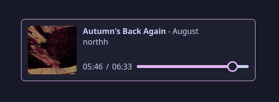

  

  

    <h2 id="gnss-war-room">WOPR Display Fork</h2>

A fork of UnexpectedMaker's WOPR display project, implementing new features, including automatically dimming the display at night and displaying GNSS data, and improving existing features by fixing flickering issues, improving the display of the clock, and better generating random codes.

Was a lot of fun to solder together and figure out how development for boards like this works :D

Powered by the ESP32-based TinyS3 board, using C++.

  

  

  

  

    <h2 id="weird-fe">weird-fe</h2>

An experimental attempt to write my own frontend for [Akkoma](https://akkoma.social/) (and anything else supporting the [Mastodon API](https://docs.joinmastodon.org/))

Written partly to experiment with whatever ideas I found interesting at the time, meaning the frontend is served as a completely static site, and heavily uses [web components](https://developer.mozilla.org/en-US/docs/Web/API/Web_components) for rendering the UI. Written almost entirely from scratch to gain more experience working with a limited set of tools and see how things work as low a level is possible for a web app.

Supports:

- Viewing posts (with attachments, content warnings, etc)
- Viewing replies to a post in a threaded view
- Viewing a user's posts, bio, etc.
- Viewing an instance's federated timeline
- Emoji reactions, including custom emojis
- Quote posts
- Akkoma's subset of [MFM](https://misskey-hub.net/en/docs/for-users/features/mfm/)

  

  

  

  <h2 id="catppuccin-musicbee">Catppuccin MusicBee</h2>

A theme for the [MusicBee](https://www.getmusicbee.com/) music player based on the very nice [Catppuccin](https://github.com/catppuccin/catppuccin) colour palettes. The project of mine I use most regularly!

Uses a combination of `bash`, `imagemagick`, `xdotool`, `wine`, and `Xvfb` (X virtual framebuffer) to automate creating the 112 different variations of the theme for every combination of theme/accent colour.

  

  

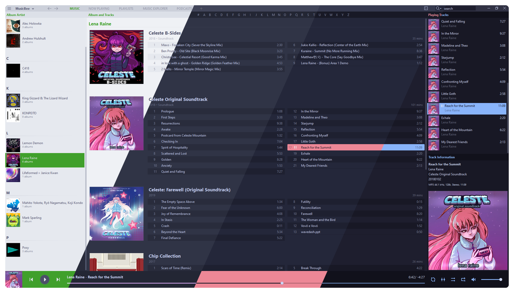

  

  

    <h2 id="planetphysics">PlanetPhysics</h2>

An [n-body](https://en.wikipedia.org/wiki/N-body_problem) planetary gravitational simulator built for fun as a side project.

Uses the less accurate [Euler method](https://en.wikipedia.org/wiki/Euler_method) for integration (this is mostly mitigated by using very small step sizes), but ideally in future it should use something like the Runge-kutta methods for better accuracy.

Includes several pre-set situations, including a fictional but nice-looking system (shown), a stable 3-body figure-8 system, a binary star system, and our solar system to scale (with and without moons)

  

  

    <video autoplay loop muted controls>
      <source src="/videos/solar_new.mp4" type="video/mp4">
      Your browser does not support the video tag.
    </video>
  

  

  <h2 id="driver">Driver</h2>

A system for creating and improving genetic neural networks. Written entirely from scratch to allow me to better understand how simple networks function, the maths behind them, and how they can perform surprisingly well!

The physics system used is also entirely custom.

The end result of which is networks which can drive a 2D car fairly well using only a handful of sensors (5 distances to the edge of the track at different angles)

  

  

  

  

  <h2 id="vistars-restyled">Datapack toolkit</h2>

An easy-to-use Minecraft worldgen datapack configuration tool, made alongside [Bee](https://everloste.github.io/)!

Still early in development, currently only supporting custom configuration screens, but with plenty more planned (editing structure set placement, picking biome definition providers from a set of packs)

  

  

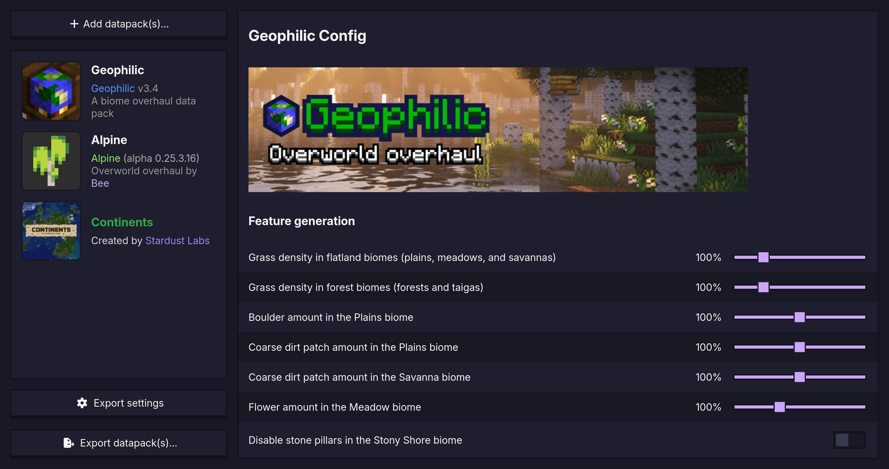

  

  

  <h2 id="vistars-restyled">Vistars restyled</h2>

A restyled version of CERN's Vistar displays, optimised for use as background screensaver or similar! Making it easier to get cool looking beam data displayed anywhere.

In no way designed to replace the proper version - my only goal is to look cool with it :D

  

  

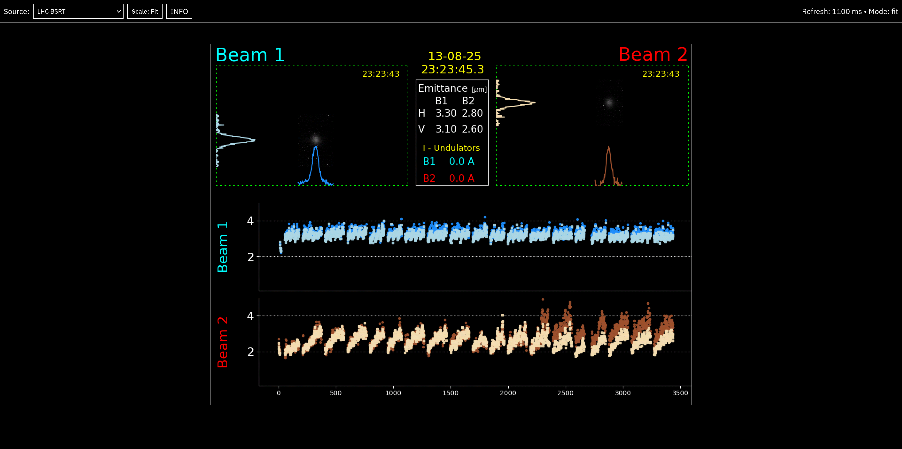

  

  

  <h2 id="driver">WOPR</h2>

A web app to generate an SVG with the given text using the HP1345A's font, hosted at <https://wopr.mck.is/>.

Most of the credit goes to Poul-Henning Kamp for [reverse engineering the HP1345A's character generator](https://phk.freebsd.dk/hacks/Wargames/) - I've just strapped it to a web app to make it easier to use for simple use-cases.

Source code not currently available, as it's related to my final year project, and I need to check that won't cause any issues.

  

  

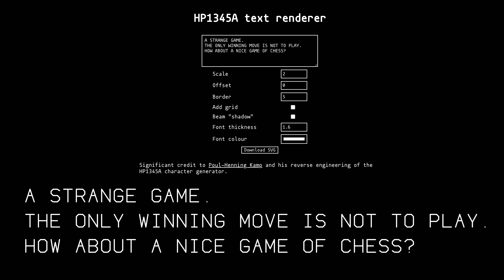

  

  

  <h2 id="rtweekend">RTWeekend</h2>

Multithreaded CPU raytracer written in C#. Based on the "Ray Tracing in One Weekend" book. Features:

- Reflections (including reflections of reflections) - Refraction (e.g. light passing through glass spheres)
- Accurate shadows
- Depth of field
- Multithreaded for significantly increased performance

Although performance could significantly be improved by running the processing on the GPU, it was still a very fun project!

  

  

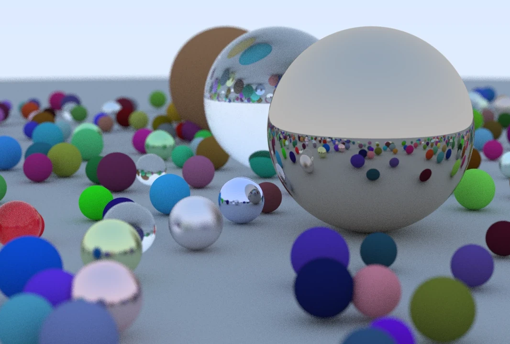

  

  

  <h2 id="markov-fetch">Markov Fetch</h2>

A script to create a database of posts compatible with the [mstdn-ebooks](https://github.com/Lynnesbian/mstdn-ebooks) or [pleroma-ebooks](https://github.com/ioistired/pleroma-ebooks)-based [markov](https://en.wikipedia.org/wiki/Markov_chain) bots.

"Better" than the original in that it supports instances using secure/authorised fetch! Rather than using ActivityPub outboxes and pretending to be an instance, which [authorised fetch breaks](https://github.com/Lynnesbian/mstdn-ebooks/wiki/Secure-fetch), this script relies on the bot's instance's API to fetch copies of posts.

  

  

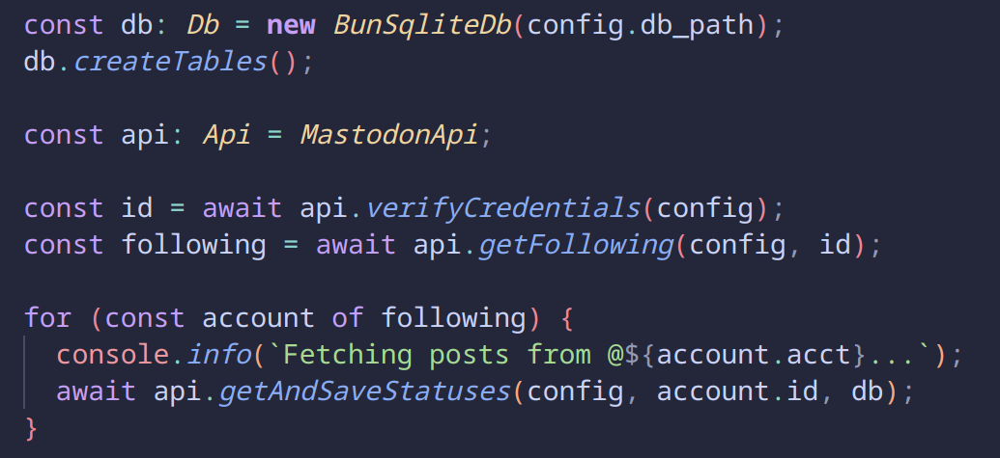

  

  

  <h2 id="website">Personal website</h2>

The website you're currently browsing! Built using [Astro](https://astro.build/), which I'm using as a static site generator to combine my typescript, markdown, and vanilla CSS into a working site!

Made to be as lightweight as possible, with the main page being only 40kb, images and everything, having both an FCP and LCP of 0.3s.

You can [read why I picked Astro](/blog/2024/new-site), or [look at how this site has changed over time](/changelog)!

  

  

  

  

  <h2 id="the-last-stand">The Last Stand</h2>

A text adventure made as a group project for our "Web Technologies" (CSC1030) module.

I designed and wrote the majority of the CSS for the layout, along with the temperature and typewriter systems used by all other group members. I also worked with them to create the inventory and timer systems also used throughout the game.

We worked great as a group, and stuck together for several group projects after this one.

  

  

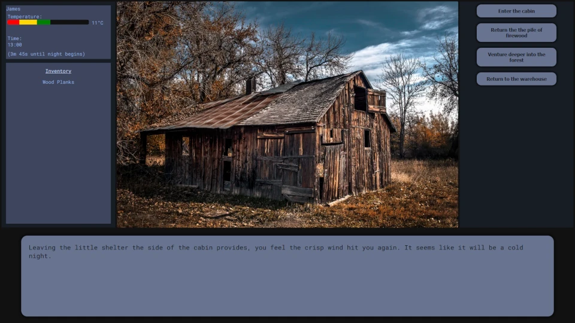

  

  

  <h2 id="powdertoy">SandSim</h2>

A small particle/powder toy simulator. Very basic - its flaws are definitely noticeable if you're looking for them, however it's still a lot of fun to mess around with, seeing how much just a few simple rules can create!

Will likely return to this one in the future to improve and expand on it, and see how I can increase performance.

  

  

    <video autoplay loop muted controls>
      <source src="/videos/powdertoy.mp4" type="video/mp4">
      Your browser does not support the video tag.
    </video>
  

  

  <h2 id="musicbee-install">MusicBee install script</h2>

A script to automate setting up [MusicBee](https://getmusicbee.com/) (A Windows application) on linux. I wrote a whole [blog post](/blog/2024/musicbee-on-linux/) on this!

- Automatically sets up a wineprefix with the required libraries
- Downloads and installs the specified version of MusicBee
- Creates an improved XDG Desktop entry
- Installs Discordbee and Wine-Discord IPC bridge to allow the song you're currently listening to to be displayed as a status

  

  

  

  

  <h2 id="a2-project">A2 Project</h2>

This application was my A2 coursework for Software Systems Development, written between 10/11/2020 and 14/03/2021 using
C# and WPF. See the [git repo](https://github.com/autumn-mck/A2-Project) for more details and features

This is still an app I'm still very proud of, it was effectively my first large project - It's got a few minor flaws, but it has some features I put a lot of work into and I'm very happy with the end result.

  

  

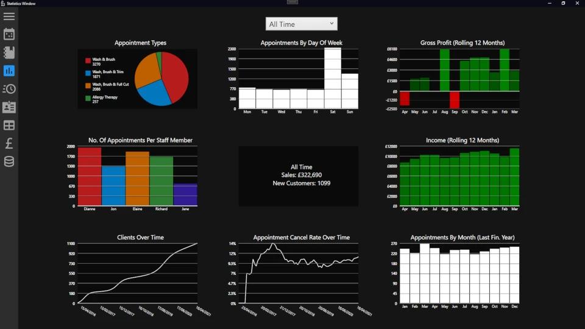

  

  

  <h2 id="csc1028">CSC1028</h2>

My project for the "Compute Science Challenges" (CSC1028) module I opted to do at university, providing all sorts of metadata on a given URL.
See my [blog post for CSC1028](/CSC1028/) for a lot more info.

  

  

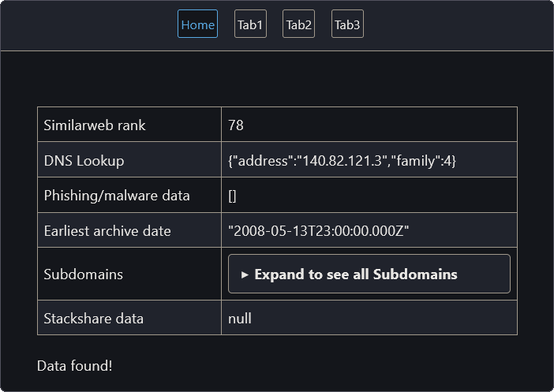

  

  

    <h2>git-music-log</h2>

A project written as a joke to see if it was possible to store a record of what music you're listening to as a list of git commits. Why? Because what's more commonly used for storing changes over time than version control software like git? (Databases, but that's not as funny)

It seemingly is possible! And you shouldn't do it, because again, databases exist.

  

  

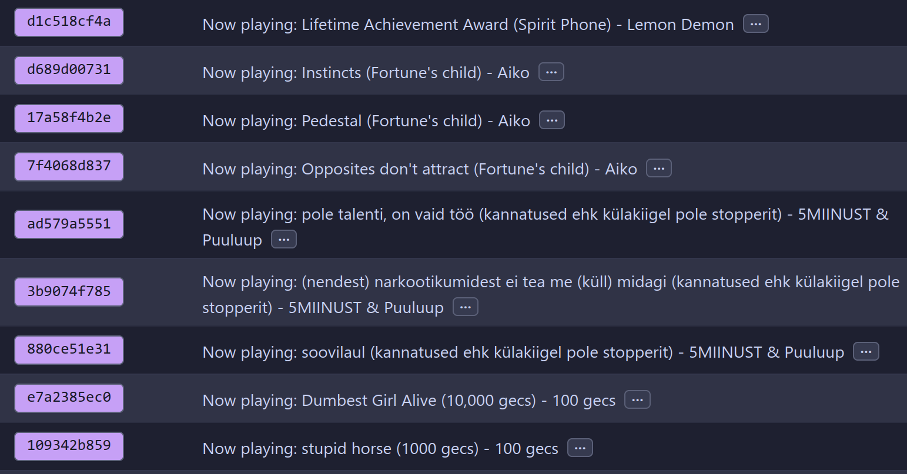

  

