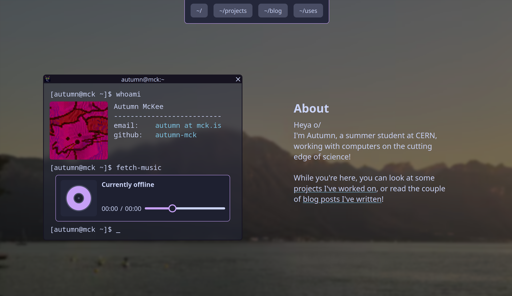

# Projects

A list of most of the projects I've worked on - mostly personal projects, with a few from university.

<!-- nothing makes sense, so i might as well make nonsense -->

## PlanetPhysics

  

    <video autoplay loop muted controls>
      <source src="/videos/solar_new.mp4" type="video/mp4">
      Your browser does not support the video tag.
    </video>
  

  

An [n-body](https://en.wikipedia.org/wiki/N-body_problem) planetary gravitational simulator built for fun as a side project.

Uses the less accurate [Euler method](https://en.wikipedia.org/wiki/Euler_method) for integration (this is mostly mitigated by using very small step sizes), but ideally in future it should use something like the Runge-kutta methods for better accuracy.

Includes several pre-set situations, including a fictional but nice-looking system (shown), a stable 3-body figure-8 system, a binary star system, and our solar system to scale (with and without moons)

[PlanetPhysics code](https://github.com/autumn-mck/PlanetPhysics)

  

## weird-fe

  

An experimental attempt to write my own frontend for [Akkoma](https://akkoma.social/) (and anything else supporting the [Mastodon API](https://docs.joinmastodon.org/))

Written partly to experiment with whatever ideas I found interesting at the time, meaning the frontend is served as a completely static site, and heavily uses [web components](https://developer.mozilla.org/en-US/docs/Web/API/Web_components) for rendering the UI. Written almost entirely from scratch to gain more experience working with a limited set of tools and see how things work as low a level is possible for a web app.

Supports:

- Viewing posts (with attatchments, content warnings, etc)
- Viewing replies to a post in a threaded view
- Viewing a user's posts, bio, etc.
- Viewing an instance's federated timeline
- Emoji reactions, including custom emojis
- Quote posts
- Akkoma's subset of [MFM](https://misskey-hub.net/en/docs/for-users/features/mfm/)

[weird-fe code](https://github.com/autumn-mck/weird-fe)

  

  

## SiteMusicDisplay

A project to display the music I'm currently listening to on my website. Has 4 parts:

- A MusicBee plugin written in C# to send the currently playing song to a server (Desktop)
- A Poweramp plugin/Android app to send the currently playing song to a server (Android)
- A server written in TypeScript with Bun to receive the currently playing song, and provide an API and/or websocket for the client (Server)
- A web component written with vanilla JS and CSS to display the currently playing song (Client)

See the [blog post](/blog/2024/small-projects-for-fun/) I wrote for more details on this!

- [MusicBee plugin code](https://github.com/autumn-mck/MusicDisplayMusicBeePlugin)
- [Poweramp plugin code](https://github.com/autumn-mck/MusicDisplayPowerampPlugin)
- [Server & web component code](https://github.com/autumn-mck/MusicDisplayServer)

<music-display
  nowPlayingApi="https://music-display.mck.is/now-playing"
  websocketUrl="wss://music-display.mck.is/now-playing-ws">
</music-display>

## Catppuccin-MusicBee

  

  

  

A theme for the [MusicBee](https://www.getmusicbee.com/) music player based on the very nice [Catppuccin](https://github.com/catppuccin/catppuccin) colour palettes. The project of mine I use most regularly!

Uses a combination of `bash`, `imagemagick`, `xdotool`, `wine`, and `Xvfb` (X virtual framebuffer) to automate creating the 112 different variations of the theme for every combination of theme/accent colour.

[Catppuccin-MusicBee code and releases](https://github.com/catppuccin/musicbee)

  

## CSC1028

  

My project for the "Compute Science Challenges" (CSC1028) module I opted to do at university, providing all sorts of metadata on a given URL. See my [blog post for CSC1028](/CSC1028/) for a lot more info.

[CSC1028 code](https://github.com/autumn-mck/CSC1028)

  

  

  

## Last Stand Text Adventure

  

  

  

A text adventure made as a group project for our "Web Technologies" (CSC1030) module.

I designed and wrote the majority of the CSS for the layout, along with the temperature and typewriter systems used by all other group members. I also worked with them to create the inventory and timer systems also used throughout the game.

We worked great as a group, and stuck together for several group projects after this one.

[Last Stand Code](https://github.com/autumn-mck/LastStand), or [play The Last Stand here](https://last-stand.mck.is/)!

  

## Driver

  

A from-scratch application with several parts:

- A 2D arcade-style driving simulation that feels fun to drive around in
- A system for creating and improving genetic neural networks written entirely from scratch to allow me to better understand how simple networks function, the maths behind them, and how they can perform surprisingly well!

The end result of which is networks which can drive a car pretty well based on only a handful of sensors (5 distances to the edge of the track at different angles by default)

[Driver code](https://github.com/autumn-mck/MonoGameDriver)

  

  

  

## CPU-based raytracer

  

  

  

A multithreaded CPU ray tracer written in C#. Based on the "Ray Tracing in One Weekend" book. Features:

- Reflections (inc. reflections of reflections) - Refraction (e.g. light passing through glass spheres)
- Accurate shadows
- Depth of field
- Multithreaded for significantly increaded performance

Although performance could significantly be improved by instead performing the processing on the GPU (Which is better suited for that kind of workload) it was still a very fun project to work on

[Raytracer code](https://github.com/autumn-mck/RTWeekend)

  

## Personal website

  

The website you're currently browsing! Currently built using [Astro](https://astro.build/). You can [read why I picked Astro](/blog/2024/new-site), or [look at how this site has changed over time](/changelog)!

[Website code](https://github.com/autumn-mck/site-astro)

  

  

  

## Particle/powder toy simulator

  

    <video autoplay loop muted controls>
      <source src="/videos/powdertoy.mp4" type="video/mp4">
      Your browser does not support the video tag.
    </video>
  

  

A small particle/powder toy simulator. Very basic - its flaws are definitely noticable if you're looking for them - but I still enjoyed messing around with this kind of cellular automaton

[PowderSim code](https://github.com/autumn-mck/ParticleSim)

  

## Authorised markov fetch

A script to create a database of posts compatible with the [mstdn-ebooks](https://github.com/Lynnesbian/mstdn-ebooks) or [pleroma-ebooks](https://github.com/ioistired/pleroma-ebooks)-based [markov](https://en.wikipedia.org/wiki/Markov_chain) bots, that supports instances using secure/authorised fetch.

Rather than using ActivityPub outboxes and pretending to be an instance, which [authorised fetch breaks](https://github.com/Lynnesbian/mstdn-ebooks/wiki/Secure-fetch), this script relies on the bot's instance's API to fetch copies of posts.

[Authorised-markov-fetch code](https://github.com/autumn-mck/authorised-markov-fetch)

## MusicBee installation script for Linux

  

A script to automate setting up [MusicBee](https://getmusicbee.com/) (A Windows application) on linux. I wrote a whole [blog post](/blog/2024/musicbee-on-linux/) on this!

- Automatically sets up a wineprefix with the required libraries
- Downloads and installs the specified version of MusicBee
- Downloads the DLLs required for playing AAC/M4A files
- Creates an improved XDG Desktop entry
- Installs Discordbee and Wine-Discord IPC bridge to allow the song you're currently listening to to be displayed as a status on Discord

[MusicBee install script here](https://gist.github.com/autumn-mck/6d7fcbbc08f5d18be09f2cc219084675)

  

  

  

## A2 Project

  

  

  

This application was my A2 coursework project for Software Systems Development, written between 10/11/2020 and 14/03/2021 using
C# and WPF. See the [git repo](https://github.com/autumn-mck/A2-Project) for more details and features

This is still a project I'm very proud of - It's got a few minor flaws, but it has some features I put a lot of work into and
I'm very happy with the end result.

[A2 Project Code](https://github.com/autumn-mck/A2-Project)

  

## 2048 fork

A significantly modified version of the original 2048, with new features including:

- Allowing boards of any size
- Support for theming, including a dark mode
- Additional challenges, such as an extra tile being added every second
- Slightly tidier code, making use of updates
  to javascript and CSS since the release of the original version

Made for fun to improve on an existing project and gain some more experience with browser javascript

[2048 code](https://github.com/autumn-mck/2048), and [playable here](https://2048.mck.is/)!

## WebGenJava

The program I wrote to convert markdown to HTML for a previous version of this website. Although there are already existing solutions that
offer this sort of functionality (eg [pandoc](https://pandoc.org/)), I wanted something that gave me slightly more
control over the result.

[WebGenJava code](https://github.com/autumn-mck/WebGenJava) (Please, don't use it)

