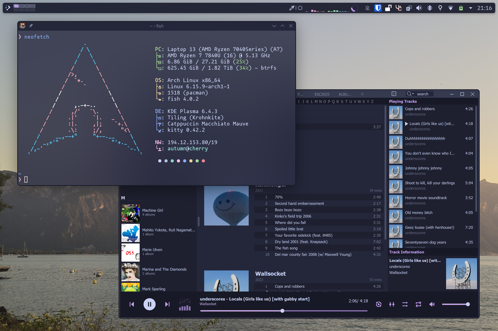

# Hardware/software I use

I always enjoy hearing other people talk about what hardware/software they use, so here's my current setup and some thoughts on it!

---

## Software

I've been running Linux on both my desktop and laptop for a few years now! I'm really happy with my current setup - It gets out of the way when I'm getting work done, but still allows me to mess around and tweak stuff when I feel like it.

Most of it is pretty standard, but there's a few extras like using [krohnkite](https://github.com/anametologin/krohnkite/) for tiling windows and [LightlyShaders](https://github.com/a-parhom/LightlyShaders) for nice rounded window corners.

I've been using Arch Linux for years now and love it, it's provided a reliable rolling base for me to build on in any way I've needed. I tried NixOS for a couple years and while I love it, it's ultimately not for me. My VPS is still running NixOS though, and it's been fantastic for that!

---

## Hardware

### Desktop (Built Summer 2019)

**CPU**: Ryzen 5 3600x - it's been a great! I should have just gone for the non-X version and saved £50 though  
**GPU**: 7800XT - a recent upgrade, partly to allow me to run whatever I need at 4k, partly to avoid nvidia's drivers that didn't properly support wayland  
**RAM**: 16gb at 3466MT/s, not much to comment on - the only times I run out of RAM are when I accidentally write a loop that eats up gigabytes of RAM  
**Motherboard**: B450 Tomahawk - Enough I/O, works well! Mostly picked because it supports updating its BIOS from a USB stick, which was needed because I built this system only days after the 3600x released.  
**Case**: A Fractal North case. High airflow gives me a quiet PC, and in my opinion it's easily the best looking ATX case in the last few years!

Overall I love it! It's been fantastic, and although it's been upgraded somewhat, it's lasted extremely well over the last 6 years.

### Peripherals

**Screen**: Second-hand 27 inch 1080p 60Hz VA (Not perfect, but hard to beat for the price of free that I got it for)  
**Keyboard**: Keychron K3 Pro - feels great to type on, not too loud, not too big. Perfectly gets out of the way to allow me to do whatever I'm doing  
**Mouse**: Logitech G502 HERO - I like it a lot but wouldn't recommend it, as I'm now on my second - the first developed serious issues with double clicking when it was only clicked once  
**Headphones**: Beyerdynamic DT 990s - Great open back headphones! Comfy and they sound good.

### Laptop

Framework 13 with an AMD 7840U - it's a fantastic laptop, and been very useful to me in the last year!

Previously I had a Lenovo IdeaPad 14ARE05 I got in 2020 for ~£400, which was an amazing deal. I wrote a whole [blog post](/blog/2024/14are05-review/) about it for some reason! The only reason I replaced it was that 8GB of memory was no longer enough for me, so I was able to give it to somebody else.

### Phone

Currently using a Samsung S24, unfortuntely the standard, boring choice is sometimes the right one. Using Nova Launcher as I love the "Swipe to open folder" feature (If you know anything open source that also has this, please let me know!)

Previously I was using a OnePlus 7t. It was a really nice phone in a lot of ways, but the quality of support from OnePlus wasn't great, and it became buggier over time with some features, like running two apps side by side on the top and bottom of the screen, breaking completely after an update and never being fixed after a year or two. I've since installed LineageOS and keep it around and set up in case I need it as a backup phone.

I used to use iOS, but after using Android for a few years now I don't think I can ever go back. The extra freedom and customisation android gives is perfect for me.

---

Last updated: 2025-07-08
