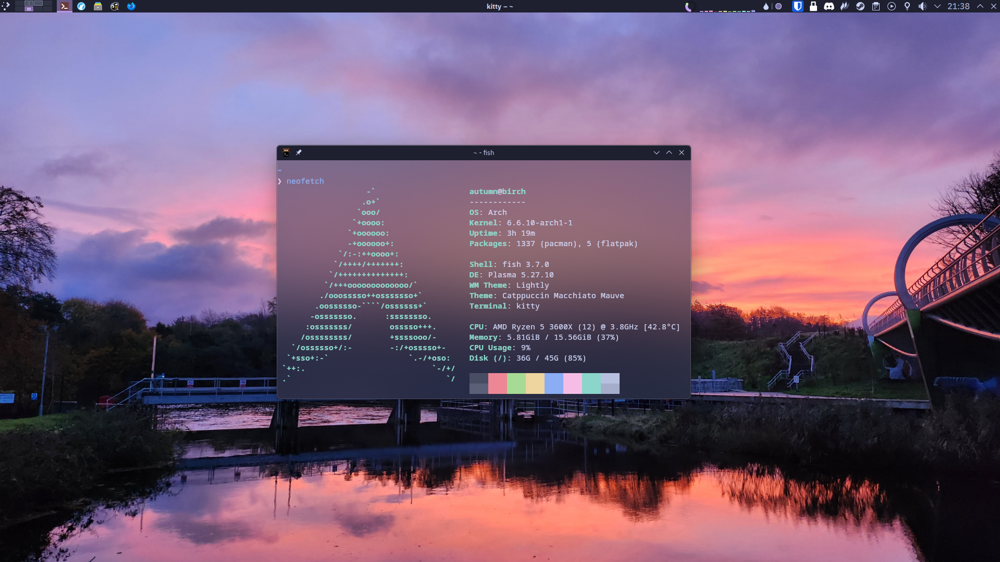
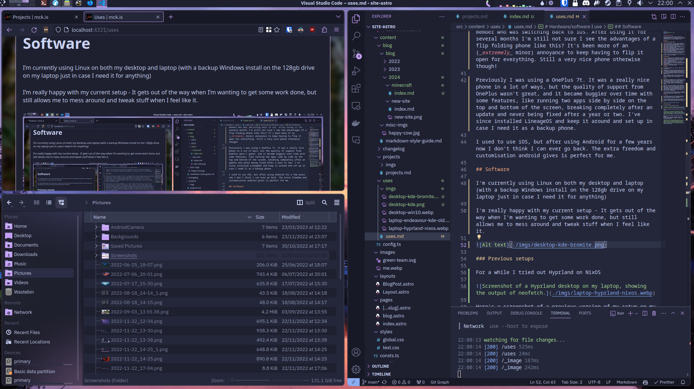
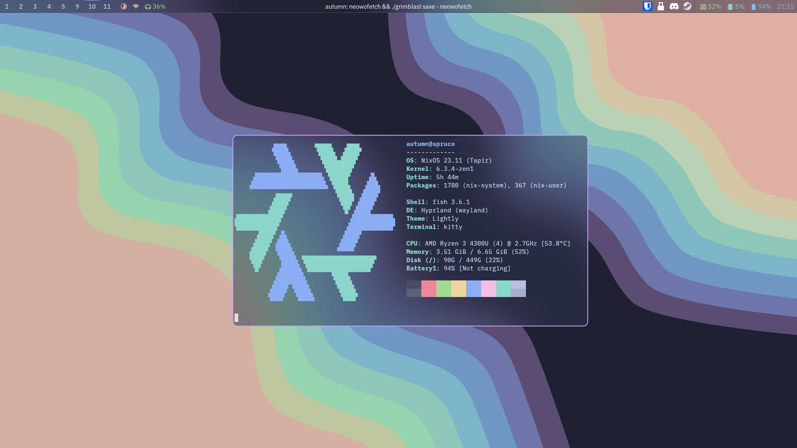
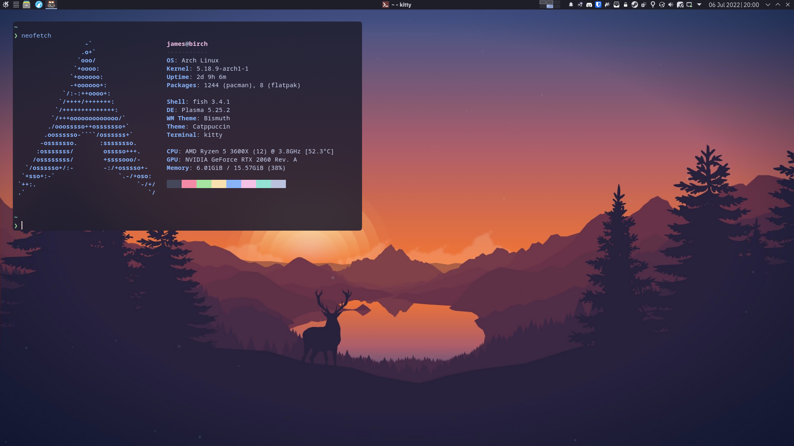
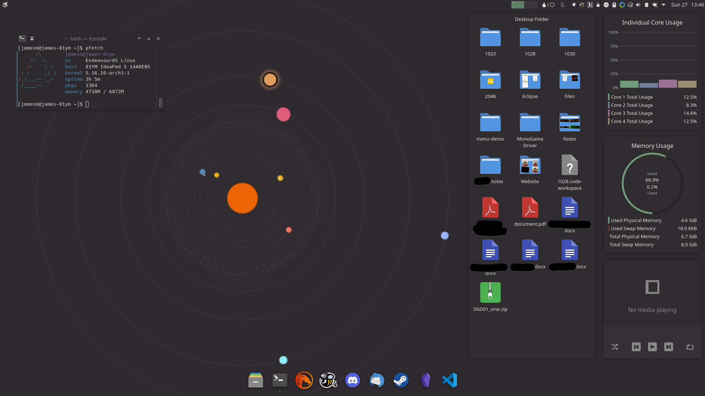
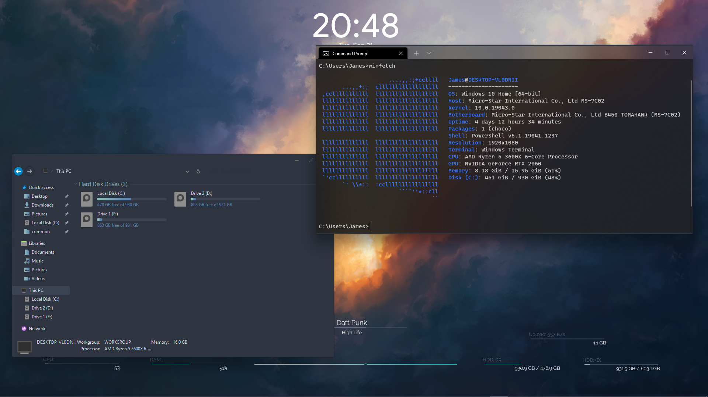

# Hardware/software I use

I always enjoy hearing other people talk about what hardware/software they use, so here's my current setup and some thoughts on it! It's also interesting for me to look back and see how what I use has changed over time.

---

## Hardware

### Desktop (Built Summer 2019)

**CPU**: Ryzen 5 3600x - it's been a great! I should have just gone for the non-X version and saved £50 though  
**GPU**: 7800XT - Recently upgraded from a RTX 2060 - partly to allow me to run whatever I need at 4k, partly to avoid nvidia's drivers that didn't properly support wayland  
**RAM**: 16gb at 3466MT/s, not much to comment on - the only times I run out of RAM are when I accidentally write a loop that eats up gigabytes of RAM  
**Motherboard**: B450 Tomahawk - Enough I/O, works well! Mostly picked because it supports updating its BIOS from a USB stick, which was needed because I built this system only days after the 3600x released.  
**Case**: A Fractal North case. High airflow gives me a quiet PC, and in my opinion it's easily the best looking ATX case in the last few years!

Overall I love it! It's been fantastic, and although it's been upgraded somewhat, it's lasted extremely well over the last 5 years.

### Peripherals

**Screen**: Second-hand 27 inch 1080p 60Hz VA (Not perfect, but hard to beat for the price of free that I got it for)  
**Keyboard**: Keychron K3 Pro - feels great to type on, not too loud, not too big. Perfectly gets out of the way to allow me to do whatever I'm doing  
**Mouse**: Logitech G502 HERO - I like it a lot but wouldn't recommend it, as I'm now on my seccond - the first developed serious issues with double clicking when it was only clicked once  
**Headphones**: Beyerdynamic DT 990s - Great open back headphones! Comfy and they sound good.

### Laptop

Lenovo IdeaPad 14ARE05 I got in 2020 for ~£400, which was an amazing deal.

The 4300u is an excellent CPU, gives great battery life (+ a 57Wh battery!) while performing well enough for my needs. It's been great for whatever university work needs done, and a bit of indie games and emulation on the side. I've since bought another 512gb of storage to add to the 128gb I bought it with.

Maybe I'll eventually look into what Framework are up to with more repairable laptops, but I plan on keeping this laptop for as long as I can, it's been great!

### Phone

Currently using a Samsung Z Flip 4 I received from a family member who was switching back to iOS. After using it for several months I'm still not sure I see the advantages of a flip folding phone like this? It's been more of an (_extremely_ minor) annoyance to keep having to flip it open for everything. Still a very nice phone otherwise though!

Previously I was using a OnePlus 7t. It was a really nice phone in a lot of ways, but the quality of support from OnePlus wasn't great, and it became buggier over time with some features, like running two apps side by side on the top and bottom of the screen, breaking completely after an update and never being fixed after a year or two. I've since installed LineageOS and keep it around and set up in case I need it as a backup phone.

I used to use iOS, but after using Android for a few years now I don't think I can ever go back. The extra freedom and customisation android gives is perfect for me.

---

## Software

I'm currently using Linux on both my desktop and laptop (with a backup Windows install on the 128gb drive on my laptop just in case I need it for anything)

I'm really happy with my current setup - It gets out of the way when I'm wanting to get some work done, but still allows me to mess around and tweak stuff when I feel like it.

Most of it is pretty standard, but there's a few extras like using [polonium](https://github.com/zeroxoneafour/polonium) for tiling windows and [Lightly Shaders](https://github.com/a-parhom/LightlyShaders) for nice rounded window corners.

### Previous setups

I also have more screenshots of other previous setups lying around:

<figure>

<figcaption>For a while I tried out Hyprland on NixOS - NixOS is extremely cool, just not right for me!</figcaption>

</figure>

<figure>

<figcaption>My current setup is pretty much this from a year and a half ago with only some stuff tweaked and moved around</figcaption>

</figure>

