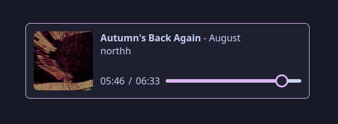

# Projects

A list of most of the projects I've worked on - mostly personal projects, with a few from university.

## PlanetPhysics

An [n-body](https://en.wikipedia.org/wiki/N-body_problem) physics simulator built for fun as a side project.  
Currently uses the rather inaccurate [Euler method](https://en.wikipedia.org/wiki/Euler_method) for integration (this
is mostly mitigated by using very small step sizes), but ideally it should use something like the Runge-kutta methods for better
accuracy.  
Includes several pre-set situations, including a fictional but nice-looking system (shown below), a stable 3-body figure-8
system, a binary star system, and our solar system to scale (with and without moons)

[PlanetPhysics code](https://github.com/James-McK/PlanetPhysics)

## CSC1028

The project I created for the CSC1028 module I opted to do, providing all sorts of metadata on a given URL. See my [blog post for CSC1028](/CSC1028/) for a lot more info.

[CSC1028 code](https://github.com/James-McK/CSC1028)

## Last Stand Text Adventure

A text adventure made as a group project for out CSC1030 module. I created the majority of the CSS for the layout, along with
the temperature and typewriter systems used by all other group members. I also worked with them to create the inventory and
timer systems also used throughout the game. We worked great as a group, and stuck together for several group projects after this one.

[Last Stand Code](https://github.com/James-McK/LastStand), or [play The Last Stand here](https://last-stand.mck.is/)!

## Catppuccin-MusicBee

A theme for the MusicBee music player based on the very nice [Catppuccin](https://github.com/catppuccin/catppuccin) colour palette. Less impressive than most of the other things here, but the one I use most regularly!

Uses a combination of `bash`, `imagemagick`, `xdotool`, `wine`, and `Xvfb` (X virtual framebuffer) to automate creating the 112 different variations of the theme.

[Catppuccin-MusicBee code and releases](https://github.com/James-McK/Catppuccin-MusicBee)

## SiteMusicDisplay

A project to display what music I'm currently listening to on my website. Has 4 parts:

- A MusicBee plugin written in C# to send the currently playing song to a server (Desktop)
- A Poweramp plugin/Android app to send the currently playing song to a server (Android)
- A server written in TypeScript with Bun to receive the currently playing song, and provide an API and/or websocket for the client (Server)
- A web component written with vanilla JS and CSS to display the currently playing song (Client)

See the [blog post](/blog/2024/music-display) for more details on this!

<music-display
  nowPlayingApi="https://music-display.mck.is/now-playing"
  websocketUrl="wss://music-display.mck.is/now-playing-ws">
</music-display>

- [MusicBee plugin code](https://github.com/James-McK/PostPublicMusicMusicBeePlugin)
- [Poweramp plugin code](https://github.com/James-McK/PostPublicMusicPowerampPlugin)
- [Server & web component code](https://github.com/James-McK/PostPublicMusicPlugin)

## Driver

An application I wrote from scratch with several parts:

- A 2D driving simulation that actually feels fun to drive around in
- A system for creating and improving genetic neural networks written entirely from scratch to allow me to better understand how
  simple networks like that actually function

... the end result of which is networks which can drive a car pretty well based on only a few sensors (5 distances to the edge
of the track at different angles)

[Driver code](https://github.com/James-McK/MonoGameDriver)

## CPU-based raytracer

A multithreaded CPU ray tracer written in C#. Based on the "Ray Tracing in One Weekend" book. Features:

- Reflections (inc. reflections of reflections) - Refraction (e.g. light passing through glass spheres)
- Accurate shadows
- Depth of field
- Multithreaded for significantly increaded performance

Although performance could significantly be improved by offloading the GPU (Which is better suited for that kind of workload) it
was still a very fun project to work on

[Raytracer code](https://github.com/James-McK/RTWeekend)

## Personal website

The website you're currently browsing! Currently built using [Astro](https://astro.build/). You can [read why I picked Astro](/blog/2024/new-site), or [look at how this site has changed over time](/changelog)!

[Website code](https://github.com/james-mck/site-astro)

## Particle/powder toy simulator

A small particle/powder toy simulator. Very basic - its flaws are definitely noticable if you're looking for them - but I still
enjoyed messing around with this kind of cellular automaton

[PowderSim code](https://github.com/James-McK/ParticleSim)

## Authorised markov fetch

A script to create a database of posts compatible with the [mstdn-ebooks](https://github.com/Lynnesbian/mstdn-ebooks) or [pleroma-ebooks](https://github.com/ioistired/pleroma-ebooks) -based [markov](https://en.wikipedia.org/wiki/Markov_chain) bots, that supports instances using secure/authorised fetch.

Rather than using ActivityPub outboxes and pretending to be an instance, which [authorised fetch breaks](https://github.com/Lynnesbian/mstdn-ebooks/wiki/Secure-fetch), this script relies on the bot's instance's API to fetch copies of posts.

[Authorised-markov-fetch code](https://github.com/James-McK/authorised-markov-fetch)

## MusicBee installation script for Linux

A script to automate setting up [MusicBee](https://getmusicbee.com/) (A Windows application) on linux. I wrote a whole [blog post](/blog/2024/musicbee-on-linux/) on this!

- Automatically sets up a wineprefix with the required libraries
- Downloads and installs the specified version of MusicBee
- Downloads the DLLs required for playing AAC/M4A files
- Installs a set of skins
- Creates an improved XDG Desktop entry
- Downloads settings so they don't have to be changed from defaults after launching
- Installs Discordbee and Wine-Discord IPC bridge to allow the song you're currently listening to to be displayed as a status on Discord

[MusicBee install script here](https://gist.github.com/James-McK/6d7fcbbc08f5d18be09f2cc219084675)

## A2 Project

This application was my A2 coursework project for Software Systems Development, written between 10/11/2020 and 14/03/2021 using
C# and WPF. See the [git repo](https://github.com/James-McK/A2-Project) for more details and features

This is still a project I'm very proud of - It's got a few minor flaws, but it has some features I put a lot of work into and
I'm very happy with the end result.

[A2 Project Code](https://github.com/James-McK/A2-Project)

## 2048 fork

A significantly modified version of the original 2048, with new features including:

- Allowing boards of any size
- Support for theming, including a dark mode
- Additional challenges, such as an extra tile being added every second
- Slightly tidier code, making use of updates
  to javascript and CSS since the release of the original version

Made for fun to improve on an existing project and gain some more experience with browser javascript

[2048 code](https://github.com/James-McK/2048), and [playable here](https://2048.mck.is/)!

## WebGenJava

The program I wrote to convert markdown to HTML for a previous version of this website. Although there are already existing solutions that
offer this sort of functionality (eg [pandoc](https://pandoc.org/)), I wanted something that gave me slightly more
control over the result.

[WebGenJava code](https://github.com/James-McK/WebGenJava) (Please, don't use it)
